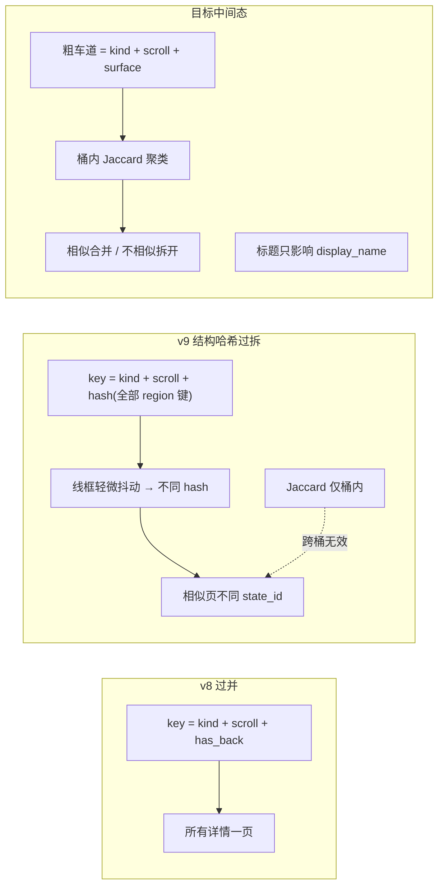

# 9月15日 — 架构聚类「过并 / 过拆」复盘

造物相机 `app_id = 3d2b9799-0027-4c7d-bfe7-8c5b88f4087d`，Screen Atlas `page.sk*` 分桶。

---

## 1. 现象（用户标注的应合并组）

| 组 | state_id（节选） | 人眼 |
|---|---|---|
| A | `sk34eae5492e21`, `sk1b4e1c51dfc0`, `sk043d264e7429` | 同一类取景/引导详情 |
| B | `sk97f9888a14d1`, `sk86517328286a`, `sk08594966ffc6`, `sk70f3754541e7` | 同一类手办详情壳 |
| C | `sk65acdd3923de`, `sk38804de341cd` | 同一类个人/信息区 |
| D | `ske80e4f18445c`, `sk61f996374197` | 同一类灵感 Feed 主面 |

v9「结构哈希版」把它们拆成 **12** 个节点；v8「仅 has_back」曾把大量详情 **挤成 1** 个节点（`sk25977…`，34 帧）。

---

## 2. 实测：相似度够，但 ID 仍不同

对每组抽代表帧，算 **结构 Jaccard**（`wireframe_structural_keys`，类名+粗几何）：

| 组 | Jaccard 范围 | `split_indices_by_wireframe_similarity`（阈值 0.40） |
|---|---|---|
| A | 0.87–0.93 | **1 簇**（应 1 页） |
| B | 0.72–0.93 | **1 簇** |
| C | 0.85 | **1 簇** |
| D | 0.80 | **1 簇** |

但同一组内 **`skeleton_fp` / `structural_cluster_token` 两两不同**（例：A 组 `645ccef0e2` vs `e31ec0293d` vs `6a803960aa`）。

**结论**：不是「骨骼不像」，而是 **分桶流水线 Stage1 用完整结构哈希当 state_id，Stage2 的 Jaccard 只在同一 Stage1 桶内生效** —— 相似页从未进入同一桶，Jaccard 无法把它们并回来。

---

## 3. 几轮改动错在哪（摆锤）

| 版本 | 第一层 key | 第二层 | 典型后果 |
|---|---|---|---|
| Tab + 标题 v7 | Tab + 标题哈希 | — | 同壳不同手办名 → 多节点 |
| **v8** | `sub\|detail\|…\|has_back`（**无结构**） | 无 | **仅「返回」就并桶** → `sk25977` 34 帧 |
| **v9 结构哈希** | key 含 **整表 region 哈希** | Jaccard 0.40 **仅同 key** | 抖动/多 1 个 region → **不同 key** → 你标的 A–D 组被拆散 |
| **v9 粗车道（当前修正）** | 仅 `surface\|kind\|cols\|scroll` | 桶内 Jaccard **0.65** | 相似度驱动合并；标题不进 key |

**根因不是「算法选错一次」**，而是把三件东西绑在同一变量 `state_id` 上反复改：

1. **物理是否同一屏**（应多访合并）  
2. **流式文案/标题**（应只改展示名）  
3. **Tab 归属**（曾绑架 slug，已去掉）

改 2 或 3 时动了 1，就会出现「改了这个坏了那个」。

---

## 4. 中间态原则（真源约定）

1. **粗车道（lane）**：`surface + framework.kind + columns + scroll_semantic` → 决定进哪个 **粗桶**；**不含** `has_back`、标题、Tab、单组件。  
2. **细合并（within lane）**：对桶内所有 turn 的线框做 **Jaccard 贪心聚类**（默认合并阈值 **0.65**）；低于阈值再拆 `*-sN`。  
3. **展示名**：侧栏选中态 → 线框最上文案 → 编辑/文档/用例/LLM；**永不写回 bucket_key**。  
4. **state_id**：`page.sk{hash(lane)}` 或拆分子桶后缀；**不要**再把 `hash(全量 region 列表)` 塞进第一层 key。

代码：`nav_app_skeleton.skeleton_fp_from_turn`（粗车道）、`nav_screen_registry._atlas_cluster_doc`（`split_indices_by_wireframe_similarity` + `turn_cluster_fp`）。

---

## 5. 仍可能错的边界（预期行为）

| 情况 | 行为 |
|---|---|
| 同车道、Jaccard ≥ 0.65 | 应合并（覆盖 A–D 组） |
| 同车道、固定件同、滚动语义不同 | 可能仍拆（符合 §4.5） |
| 流式区文案不同、壳一致 | 合并；标题在 meta 众数/编辑 |
| 稀疏帧（region 很少） | 靠 Jaccard；极稀疏可能单独一桶，可 Studio 钉/并 |

---

## 6. 验收建议

刷新 atlas 后检查：

- A 组取景详情 → **1** 个 `page.sk*`（或 1 主 + 明确子流程再拆）  
- B 组手办详情壳 → **1–2** 个（若 坐班大圣/桌台猴王 壳真不同，Jaccard 会拆；若壳同应 1）  
- 不再出现「34 帧仅因返回并一桶」  

相关：`9月15日-架构重复展示多个相似页面问题.md`、`9月15日—架构图采集页面合并异常.md` §6。
