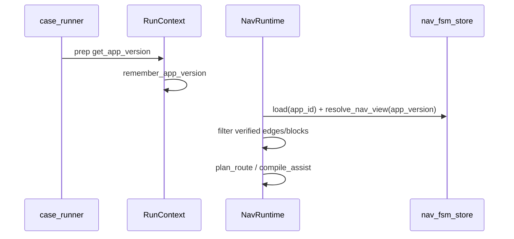

# 9月16日 — 增加应用版本差异识别以及新版本预期修改功能（方案 v1）

**背景**：跑批时 Scout 经 `get_app_version` 回传版本，`RunContext.app_version` 已可记录（[`runtime/run_context.py`](../mino_nexus/runtime/run_context.py)）。Nav 配置侧 `nav_fsm` 表的 `version` 字段目前是 **配置修订号**（`v1` / `draft`），**不是** APK 的 `1.2.3`（[`models/nav_fsm.py`](../mino_nexus/models/nav_fsm.py)）。新版本 PRD 常 **改登录步数、改 Tab、改骨骼**，若仍用单一 Atlas + 单一 FSM，会出现：**路线按旧版编译**、**localize 对不上新壳**、或 **用例/文档描述的新流从未跑过却被当成真**。

**关联**：页面流转 [`9月16日—增加页面流转识别功能.md`](9月16日—增加页面流转识别功能.md)（块 + driver）；多态 morph [`9月16日-增加页面切换多态识别能力.md`](9月16日-增加页面切换多态识别能力.md)；导航执行 [`9月16日-用例执行调用fsmnavigate能力异常.md`](9月16日-用例执行调用fsmnavigate能力异常.md)。

**优先级**：**V0 版本戳与视图切换**；**V1 运行时按 `app_version` 选边/选骨骼**；**V2 待验证层（PRD/用例 diff）**。

**状态**：Nexus **V0/V1 已落地**（采集 `app_version`、`nav_views`、runtime/Atlas 按视图过滤 pending 边、calibration-report）；facet/PRD job（V2+）待续。

---

## 0. 目标（对应需求 7.0–7.2.4）

| 编号 | 需求摘要 | 本方案交付 |
|------|----------|------------|
| **7.1** | 导航模式按 **当前安装版本** 给正确路线 | `app_version` → **有效 Nav 视图** + 边/块过滤 |
| **7.2** | PRD 变更产生 **待验证** 逻辑块与流转线 | `verification_status` + 候选 compiler |
| **7.2.1** | 架构图 **切换版本** 看块/页/边 | Studio version selector + 图层 |
| **7.2.2** | 分析用例/需求 **提议** 待验证块与边 | LLM + 规则 job → **pending only** |
| **7.2.3** | 指定版本 **改骨骼展示**（未真实跑过） | `skeleton_overlay` per `app_version_range` |
| **7.2.4** | **同 `page.sk*`、不同版本不同骨骼**；导航严格发 **当前版本** 逻辑 | `state.meta.version_facets` + compile 路径 |

**非目标**：自动把待验证内容 merge 进正式 runtime；在 Nexus 写死「2.0 去掉 XX Tab」类 App 规则；替代 Console 发版流程。

---

## 1. 术语：两种「版本」

| 名称 | 示例 | 用途 | 存储 |
|------|------|------|------|
| **`config_version`** | `v1`, `draft` | NavFSM 配置修订、发布流 | `nav_fsm.version`（已有） |
| **`app_version`** | `3.2.1`, `30201` | 被测 APK/IPA | `RunContext.app_version`；capture 样本 meta |
| **`nav_view_id`** | `av:3.2.x`, `av:default` | **一组 states/edges/flow_blocks 的有效快照** | 新增 `nav_fsm.meta.nav_views[]` 或独立表 |

**铁律**：`app_version` **不得** 直接覆盖 `config_version` 字符串；二者正交，通过 **`nav_view_id` + range 匹配** 关联。

### 1.1 版本匹配

```text
app_version "3.2.4"  →  匹配 nav_view range "3.2.*"  →  view av:3.2
无版本 / 首次探索     →  av:default（仅已验证层）
```

匹配规则（建议）：**SemVer 优先**；Android `versionCode` 可映射为 `meta.version_code` 辅助；匹配失败 → **degraded 视图** + assist 明示「版本未校准，路线仅供参考」。

---

## 2. 图层：已验证 vs 待验证（7.2）

### 2.1 状态枚举

| `verification_status` | 含义 | 参与 runtime 规划 | Studio 展示 |
|----------------------|------|-------------------|-------------|
| **`verified`** | 至少一条 **匹配 app_version** 的 session 采集证实 | ✅ | 实线 |
| **`pending`** | 来自 PRD/用例/人工草图，**无**足够 capture | ❌（默认） | 虚线 / 幽灵节点 |
| **`rejected`** | 人工否 | ❌ | 隐藏 |
| **`superseded`** | 被新版 pending 取代 | ❌ | 灰显 |

**与 v2.5 候选关系**（[`NAVIGATION_ATLAS.md`](NAVIGATION_ATLAS.md) §19）：待验证 **就是** 特殊 `candidate` + `verification_status=pending`；**禁止** P1-4 式 silent auto-accept。

### 2.2 待验证对象类型

1. **新 `flow_block`**（见流转方案 §3）
2. **新 nav 边** `from → to`（`missing_edge` feedback 扩展）
3. **已有 `page.sk*` 的骨骼 overlay**（7.2.3 / 7.2.4）
4. **边 execute 变更**（例如 2.0 把「微信登录」换成「手机号一键」）

---

## 3. 同页不同版本骨骼（7.2.3 / 7.2.4）

### 3.1 问题

- **state_id 稳定**（NAVIGATION §0.1）≠ **线框随版本变**。
- 若只改 `display_name`，localize 仍可能对；**若壳层变**，需 **版本化 facets**，而不是 **新 `page.sk*`**（否则图爆炸，重蹈 v9 过拆）。

### 3.2 `version_facets`（挂在 state.meta）

```json
{
  "state_id": "page.sk_login_phone",
  "meta": {
    "layout_extent": { "height": "finite", "width": "finite" },
    "version_facets": [
      {
        "nav_view_id": "av:3.1",
        "verification_status": "verified",
        "wireframe_ref": "capture/.../turn_12",
        "identify_patch": { "required": [] }
      },
      {
        "nav_view_id": "av:3.2",
        "verification_status": "pending",
        "wireframe_ref": "pending/prd_login_redesign.json",
        "identify_patch": { "proposed_required": [] },
        "source": { "kind": "prd", "entry_id": "..." }
      }
    ]
  }
}
```

**规则**：

- **localize / assist / fsm_navigate** 在 `stamp_app_version` 后只读 **当前 nav_view 对应 facet**；无 facet 则回退 default 主 wireframe。
- **`verification_status=pending` 的 facet 不参与** `plan_route` 与 **高置信 localize**；可出现在 Studio 「预期 diff」层。
- **骨骼不变、仅文案变** → 优先 **aliases / morph**，不新增 facet（对齐 morph v2）。

### 3.3 导航编译「严格发当前版本逻辑」（7.2.4）

| 阶段 | 行为 |
|------|------|
| `plan_route` | 边集合 = `verified` 且 `app_version ∈ edge.meta.version_range` |
| `tap_params_for_edge` | `target_page` / selector 来自 **该版本** execute 载荷 |
| `compile_assist` | 路线列表标注 `(app 3.2.x)`；若边仅 pending 存在 → **declined + 待验证** |
| agent-decide | 新字段 `nav_view_id`, `app_version`, `pending_routes[]`（v13+） |

**避坑**：不要用 **全局** `_hydrate_atlas_edge_execute` 写死一份 execute 覆盖所有版本；改为 **view 级 merge** 或 edge 级 `executes: { "av:3.2": {...} }`。

---

## 4. 从新版本需求生成待验证（7.2.2 / 7.2.3）

### 4.1 输入

| 来源 | 提取 |
|------|------|
| 用例 diff（新版 case JSON） | 新步骤、新目标页口语 |
| `knowledge_entries` / PRD 片段 | 流程章节、UI 改版说明 |
| 产品指定的 **目标 app_version** | `nav_view_id` |
| 现有 Atlas | states/edges/flow_blocks **基线** |

### 4.2 输出（全部 pending）

Job（拟 `nav-version-expectation`，Console Jobs 真源）：

1. **新增 flow_block** 提议 + 有序 state（可引用 **已有 sk** 或 **placeholder `page.pending.*`**）
2. **新增/变更边** + `version_range`
3. **version_facets** 的 wireframe 草图（来自 PRD 截图 **仅 Studio 人工贴**，Nexus 不 import cv2；或文本描述供人工绘）

### 4.3 人工闭环

```
分析 job → candidates (pending)
    → Studio 版本视图预览（虚线）
    → 真机跑新版采集 → facet 转 verified
    → promote draft → config_version v1'
```

**重复踩坑防护**：

| 历史坑 | 本特性对策 |
|--------|------------|
| 未采集边自动进库 | pending **永不** 进 `plan_route` |
| 架构页 PUT 整库覆盖（P1-2） | 待验证只写 **candidates / meta.nav_views** |
| Tab 文案硬编码 | 版本 diff 只输出 **结构/边/id 候选**，文案走 aliases 治理 |
| 探索污染正式库 | 采集按 **`app_version` 分桶**；promote 时校验 version 一致 |
| 模型把 pending 当完成 | assist **必须** 标「待验证预期，非实测」 |

---

## 5. 架构页：切换版本查看（7.2.1）

### 5.1 UI

- 顶栏：**App 版本 / nav_view** 下拉（`default` | `3.1.x` | `3.2.x (pending overlay)`）。
- 图层开关：**已验证** / **待验证** / **仅 diff**。
- 与 **flow_block** 联动：块也可 `verification_status`；块内页列表随 view 过滤。
- **骨骼预览**：同节点切换 facet 时 **线框 cross-fade**（Studio 本地）。

### 5.2 数据 API

- `GET /nav-fsm/{app_id}/screen-atlas?nav_view_id=av:3.2`
- 响应：`states`（合并 facet 后的 **effective_wireframe**）、`edges`（filtered）、`flow_blocks`、`pending_summary`

---

## 6. 运行时：7.1 按版本选路线

### 6.1 流程



### 6.2 与 session / 账号

- **`account_id` + `app_version`** 双键过滤 capture 证据（v2.5 §19.7 账号漂移扩展）。
- 旧 session（无 version meta）→ 归入 `av:default`，不参与新版 pending 验证计数。

### 6.3 与 check_app_version 用例

能力目录已有 `check_app_version`（[`session_gate`](mino_nexus/runtime/session_gate.py)）。版本 Nav 视图切换 **不替代** 用例断言；仅当用例要求「最低版本」时，assist 可提示 **当前 view 不满足 range**。

---

## 7. 存储方案（讨论稿）

### 7.1 推荐：meta 扩展 + 样本分桶（首期）

| 数据 | 位置 |
|------|------|
| `nav_views[]` 定义 | `nav_fsm.meta` 或 atlas meta |
| `version_facets` | `nav_fsm_states.identify` 或 state JSON meta |
| 边多版本 execute | `nav_fsm_edges.execute` → `{ "by_view": { "av:3.2": {...} } }` |
| capture 样本 | `data_dir/nav/capture/{app_id}/{session_id}/` + turn meta **`app_version`** |
| pending 提议 | `data_dir/nav/candidates/...`（已有） |

### 7.2 可选：独立表（规模变大后）

`nav_app_views(app_id, view_id, version_range, status)`  
`nav_state_facets(state_id, view_id, wireframe_json, verification_status)`

**迁移**：additive ALTER（[`core/migration.py`](../mino_nexus/core/migration.py)）；旧数据 **全进 `av:default` verified**。

---

## 8. 业界对照

| 来源 | 做法 | 本仓 |
|------|------|------|
| **Appium / BrowserStack** | capability 指定 platformVersion | `app_version` → nav_view |
| **Feature flags** | 未开启功能不可达 | pending 边不参与规划 |
| **API 版本化** | `/v1` vs `/v2` 并存 | `executes.by_view` |
| **Visual regression** | baseline 按 build | facet wireframe_ref 按 capture |
| **Figma branching** | 主文件 + 提案分支 | verified + pending overlay |
| **GraphQL @deprecated** | 旧 field 仍读 | 旧 view range 保留 verified 边，新版 superseded |

---

## 9. 实施分期

| 阶段 | 交付 | 验收 |
|------|------|------|
| **V0** | turn capture 写 `app_version`；calibration-report 按版本分桶 | 报告可筛 3.1 vs 3.2 样本数 |
| **V1** | `resolve_nav_view` + verified 边过滤 + assist 标注版本 | 3.2 仅 pending 登录边时 plan declined |
| **V2** | `version_facets` + Studio 切换 + 同 sk 多骨骼展示 | 7.2.4 截图场景可演示 |
| **V3** | PRD/用例 job → pending 块/边/facet | 人工 accept 后可见虚线 |
| **V4** | promote 门禁：pending 不可进正式 unless verified | 自动化测 + P1-4 回归 |

---

## 10. 验收标准

1. 安装 **3.2.0**，用例目标「新版两步登录」：**仅** 在 3.2 view 下出现第二条 pending 边；3.1 view 仍显示旧一步登录 **verified** 路线。
2. `fsm_navigate` 在 3.2 上 **不得** 执行仅存在于 pending 的 tap（必须 declined + 原因含 `pending_verification`）。
3. Studio 切换 `3.1.x` / `3.2.x`，**同一 login state 节点** 展示 **不同线框**（facet），state_id 不变。
4. 用例/PRD job 产出 ≥1 pending flow_block；**未经 accept** 不出现在 runtime assist 的【路线】正文（可出现在「预期变更」折叠段）。
5. **无 app_version** 的旧跑批：行为与现网 **一致**（仅 `av:default`），零回归。

---

## 11. 代码索引（预期落点）

| 模块 | 路径 |
|------|------|
| 版本戳 | `runtime/run_context.py`（已有）；capture meta `nav_capture_store` |
| view 解析 | `services/nav_version_views.py`（新） |
| 边/execute 合并 | `services/nav_route.py`、`nav_screen_registry._hydrate_atlas_edge_execute` |
| localize facet | `services/nav_localize.py` |
| 候选 job | `services/nav_candidate_compiler.py` + `ai/job_*` |
| API | `routers/rNavFsm.py` |
| Studio | 版本选择器 + pending 图层 |

---

## 12. 非目标

- 自动从 APK 反编译 UI（违反 Nexus 不碰设备/不做识别依赖）。
- 多版本 **自动 merge** 成一张「全集图」供规划（规划只用 **当前 view 有效子图**）。
- 替代 Git / 发版系统的 **变更单** 流程；Nexus 只存 **导航语义** 与证据指针。

---

## 13. 与「页面流转识别」的衔接

| 流转方案 | 版本方案 |
|----------|----------|
| `flow_block` | 块级 `version_range` + `verification_status` |
| `transition.driver` | 与版本无关；execute 可 per-view |
| `flow_context` | 增加 `nav_view_id`、`pending_step` 标志 |
| Studio 块布局 | 版本切换时块内节点集可能不同（filter） |

两稿 **可并行讨论**；实现建议 **V0/V1 版本戳** 先于 **F3 flow_context**，避免 assist 字段同时大变。
