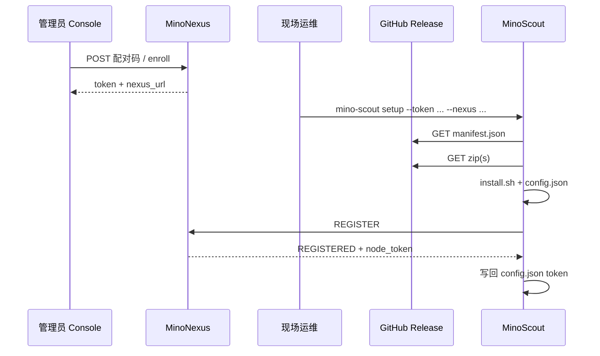

# Studio 拆分 Scout — 自助安装、升级与配置（2026-09-18）

## 1. 背景与目标

产品方向：**执行机不再依赖 Mino Studio 安装/升级**。现场只装 **MinoScout**（+ 可选 Console 在浏览器里管归属），Studio 从「安装向导 + IPC 写盘」退化为可选工作台。

本方案要解决四件事：

| # | 问题 | 目标 |
|---|------|------|
| A | v0.1.19 只更 browser 层导致 **Playwright 驱动认 1234、磁盘是 1243**，`web{scout_id}` 离线 | 升级策略保证 **runtime ↔ browser 原子一致** |
| B | 安装/增量更新逻辑在 **Studio Electron**（`scoutSetup` + `scoutLayers.cjs`） | 迁到 **Scout 自身**（`mino-scout setup` / `update`） |
| C | 配对凭证只经 Studio `install-token`，Console 403；15 分钟 TTL 不适合常驻进程 | **Console 发码 + 首次 REGISTER 换长期 node 凭证** |
| D | `studio_id` / 归属人只在 REGISTER 与 Nexus 内存/JSON 里拼 | **本地配置文件为真源**，Nexus **可改归属**并下发/回写 Scout |

本文是 **方案真源**；实现分阶段落在 MinoScout（安装/升级/本地配置）与 MinoNexus（凭证、归属 API）。Studio 文档 `SCOUT_INSTALL.md` 在落地后标为「遗留路径」。

---

## 2. 现状摘要

### 2.1 Studio 路径（今天要废弃为唯一入口）

```
Console/Studio 登录 → POST /runtime/nodes/install-token
→ GitHub manifest.json → Electron scoutSetup
→ 停 Scout → 下 zip → sha256 → install.sh → config.json → 启 Scout → REGISTER
```

- Nexus **不托管** zip（`CLAUDE.md` / `README.md`）。
- 分层决策在 `MinoStudio/electron/scoutLayers.cjs`，与 `MinoScout/scripts/layers.py` **双份**，已发生过漂移。

### 2.2 本地目录（不变根）

与 `MinoScout/packaging/install.sh`、`config.py` 一致：

| OS | 安装根 `$PREFIX` |
|---|---|
| macOS | `~/Library/Application Support/MinoScout` |
| Windows | `%APPDATA%\MinoScout` |
| Linux | `~/.config/minoscout` 或 `$XDG_CONFIG_HOME/minoscout` |

```
$PREFIX/
├── config.json          ← 连接与归属（见 §4）
├── cache/               ← 如 ADBKeyboard.apk
├── bin/
│   ├── mino-scout
│   ├── _internal/       ← runtime
│   ├── app/mino_scout/  ← app 层
│   ├── ms-playwright/   ← browser 层
│   └── layers.txt       ← 已装三层指纹（升级比对真源）
└── logs/ …
```

### 2.3 v0.1.19 Chrome 事故（必须写进升级策略）

- **runtime 指纹** `rt-*` 只 hash `pyproject` 声明（含 `playwright>=1.55`），**不含** PyPI 解析版本与 `browsers.json` 的 chromium revision。
- CI 每次 `playwright install chromium` 可能拉到 **新 revision** → **browser 指纹 `bw-*` 变**，runtime 指纹 **不变**。
- Studio 增量：**跳过 runtime，只下 browser+app** → 本机 `_internal` 仍认 **1234**，磁盘 **1243** → `probe_playwright` 失败 → `web{scout_id}` offline。

**结论：** 不能把「browser 单独升级」当成安全路径，除非 runtime 内嵌 driver revision 与 `ms-playwright/` 目录 **绑在同一升级单元**。

---

## 3. 设计原则

1. **包从 GitHub Release 来**，Nexus 只给 **凭证与归属**，不给 zip。
2. **安装态真源在本机文件**（`config.json` + `bin/layers.txt`）；Nexus 不存 Scout 版本号真源。
3. **升级计划在本机算**（读 manifest + `layers.txt`），与 Studio 解耦。
4. **browser 与 runtime 耦合**：要么一起换，要么都不换（见 §5）。
5. **循环代码不感知 Studio**；Scout CLI/子命令不算「循环」，不违背 `RouterProxy` 铁律。
6. **归属可远程改**：Nexus 改 `studio_id` / `owner_user_id`，Scout 下次 REGISTER 或心跳携带；必要时 Nexus 推送 `EXECUTE node.apply_config`（可选阶段）。

---

## 4. 本地配置文件

### 4.1 `config.json`（唯一连接 + 归属文件）

路径：`$PREFIX/config.json`（与 today 相同，**不新增** `config.d` 碎片，避免 install.sh / launchd 只认一处）。

建议字段（向后兼容现有 Studio 写入）：

```json
{
  "nexus_url": "http://mino.local:10104",
  "token": "<node_credential>",
  "scout_id": "e22615fbbb917111",
  "studio_id": "577f26389911b1cd",
  "owner_user_id": "",
  "version": "0.1.19",
  "manifest_url": "https://github.com/.../manifest.json",
  "updated_at": "2026-09-18T03:00:00.000Z"
}
```

| 字段 | 谁写 | 说明 |
|------|------|------|
| `nexus_url` | 首次 `setup` / 人工 | HTTP 源站，Scout 推导 `ws://…/node` |
| `token` | 首次配对 / Nexus 换发 | **长期 node 凭证**（§6），非 15min install-token |
| `scout_id` | Scout 首次运行 | 与 REGISTER `node_id` 一致，持久 |
| `studio_id` | Nexus 或 setup 参数 | REGISTER.studio_id；空表示未归属工作台 |
| `owner_user_id` | **仅 Nexus 下发** | 列表过滤用；Scout 本地可缓存，以 Nexus 为准 |
| `version` | `setup`/`update` 成功写回 | 最后一次装上的 **app 层版本** |
| `manifest_url` | 可选，默认 GitHub latest | 内网可覆写 |

**不**把 `layers.txt` 并进 `config.json`：`layers.txt` 已在 `bin/`，由 install 脚本维护，升级逻辑 **只读** 它（与 Studio  today 一致）。

### 4.2 升级过程临时态（可选）

若需要断点续传，可在 `$PREFIX/update.state.json`（仅升级中 exist，完成后删除）：

```json
{
  "target_version": "0.1.20",
  "plan": { "mode": "layers", "steps": ["runtime", "app"] },
  "started_at": "…"
}
```

首版可不做；`setup`/`update` 原子完成即可。

### 4.3 环境变量（保留）

`MINO_SCOUT_HOME`、`PLAYWRIGHT_BROWSERS_PATH`、ADB Keyboard 相关变量行为不变。

---

## 5. Scout 自助安装与升级

### 5.1 CLI 子命令（MinoScout）

| 命令 | 作用 |
|------|------|
| `mino-scout setup` | 首次：拉 manifest → combined 或分层 → `install.sh` → 写 `config.json` → 注册服务 |
| `mino-scout update` | 已安装：读本机 `bin/layers.txt` → 计划 → 停进程 → 装层 → 启进程 |
| `mino-scout configure` | 改 `nexus_url` / `token` / `manifest_url`（不下载） |
| `run` / `probe` / `status` / `stop` | 已有 |

**实现要点：**

- 将 `MinoStudio/electron/scoutLayers.cjs` 的 `planScoutUpdate` **移植为** `mino_scout/packaging/plan.py`（或 `scripts/plan_update.py` 可被冻结 app  import），**单份真源**；CI 跑同一套单测（迁 `test:scout-layers` 到 Scout 仓）。
- 下载：复用 Scout 已有 `httpx`（`adb_command._download_apk` 模式），校验 manifest `sha256`。
- 安装：解压到 staging 后调用现有 `packaging/install.sh`（`MINO_SCOUT_SKIP_SERVICE=1` 用于自检）。
- 升级前：`mino-scout stop`；装完后：launchctl/systemd 与 install.sh  today 相同。

### 5.2 无 Studio 首次安装流程



运维 **不需要** Studio；只需要配对码 + 能访问 GitHub（或内网 mirror URL 写在 `manifest_url`）。

### 5.3 Chrome / 分层升级策略（修复 v0.1.19 类问题）

**打包侧（MinoScout CI，Phase 0）：**

1. **锁定 Playwright**：`pyproject.toml` 改为 `playwright==x.y.z`（或 lockfile），避免 CI 日漂。
2. **runtime 指纹纳入 driver revision**：在 `scripts/layers.py` 的 `runtime_key()` 材料中加入  
   `_internal/playwright/driver/package/browsers.json` 里 **chromium revision**（或 `RUNTIME_ABI` +1 并文档化）。
3. **manifest 增加约束字段**（可选）：  
   `layers.runtime.chromium_revision`、`layers.browser.dirs` 必须一致；`write_manifest.py` 校验。

**升级计划侧（Scout `plan.py`，Phase 1）：**

```
若 manifest.browser.dirs 与 本机 runtime 内嵌 revision 不一致
  → 必须把 runtime + browser 放进同一 plan（或强制 combined）
若仅 app 层 key 变化且 requires_runtime 匹配
  → 只下 app
禁止：仅 browser key 变化而 runtime key 未变但 runtime zip sha256 与 release 不一致
  → 检测方式：manifest 每层带 sha256，本机记录 last_seen_sha256 在 config.json 或 layers 旁 local-release.json
```

**简版规则（首版可实现）：**

- 若 plan 包含 **browser** 层，则 **必须同时包含 runtime** 层（顺序 runtime → app → browser）。
- app 层 `requires_browser` 与 `requires_runtime` 由 install.sh 校验；Scout planner 在下载前做同样检查。

**热修 v0.1.19 已坏机器：** 下 v0.1.17 browser 层或 combined，再 `update` 到修复后的 release（Phase 0 发布后）。

### 5.4 `node.update` 与远程触发

协议已有 `EXECUTE node.update`（Scout 侧曾返回「未实现」）。落地后：

- Nexus `POST /runtime/nodes/{id}/command` `update` → Scout 内调 `update` 同逻辑（**仅本机**）。
- 无 Studio 时，Console 管理员对在线节点点「更新」即可。

---

## 6. Nexus：凭证与归属

### 6.1 配对与长期 token

| 阶段 | 行为 |
|------|------|
| 发码 | Console（或 API）`POST /runtime/nodes/install-token` **或** 新 `POST /runtime/nodes/enroll`；去掉 Console 的 client_gate 403 |
| 首次 REGISTER | token = install/enroll 码 → 校验通过 → 签发 **node_token**（随机、可吊销、绑定 `node_id`） |
| REGISTERED 载荷 | 增加 `node_token`（或 HTTP 仅首次返回一次）；Scout 写入 `config.json`，后续 REGISTER 用 node_token |
| install_token | 一次性或短 TTL，** consumed 后作废** |

表：`node_credentials`（`node_id`, `token_hash`, `owner_user_id`, `created_at`, `revoked_at`）或扩展现有 `install_tokens`。

环境变量 `MINO_NEXUS_NODE_TOKEN` 保留为**单节点实验室**兜底，文档标 deprecated。

### 6.2 修改归属（studio / 归属人）

需求：设备在 A 测试员名下，Console 管理员改到 B 或改绑 Studio。

**建议 API（MinoNexus）：**

```
PATCH /runtime/nodes/{node_id}
Body: { "studio_id": "...", "owner_user_id": "..." }   # 管理员或 resource owner
```

行为：

1. 更新 `nodes.json` / DB 持久化（与 today `node_store` 对齐）。
2. 若节点 **在线**：`EXECUTE node.apply_config`（新 cap）payload `{ studio_id, owner_user_id }` → Scout 合并写 `config.json` → 下一帧 REGISTER 一致。
3. 若 **离线**：仅 Nexus 侧生效；Scout 下次连上时 Nexus 在 REGISTERED.warnings 或专用 push 告知拉取配置。

**Scout 侧：**

- REGISTER 继续带 `studio_id`（读 `config.json`）。
- `owner_user_id` **不必**由 Scout 上报（Nexus 真源在服务端）；若本地缓存仅为展示，以 PATCH 下发为准。

**权限：**

- 改 `owner_user_id`：管理员或 IAM `scout_install` 超集。
- 改 `studio_id`：管理员或该 studio 负责人（与 today 节点列表过滤一致）。

### 6.3 HTTP 文档同步

落地后更新 `docs/HTTP.md`：Console 可发码、PATCH 节点归属、`node.update` 语义。

---

## 7. Studio 的角色（拆分后）

| 能力 | Studio | Console | Scout CLI |
|------|--------|---------|-----------|
| 本机安装/升级 | 可选保留 IPC（兼容） | 否 | **主路径** |
| 发配对码 | 可以 | **应该** | 否 |
| 节点列表 / 远程 restart | 可以 | 可以 | — |
| 改归属 | 否（改 Console） | **是** | 接收下发 |

Studio 的 `scoutSetup` 在 Phase 2 可改为 **调用本机 `mino-scout update` 子进程**，避免长期双份 planner。

---

## 8. 分阶段实施

### Phase 0 — 止血（MinoScout 发版）

- [ ] 锁定 `playwright` 版本；manifest v0.1.20 恢复 **runtime+browser 一致**（1234 或整组 1243）。
- [ ] `runtime_key` 含 chromium revision **或** `RUNTIME_ABI` bump + 全量 runtime 重发。
- [ ] 文档说明已坏节点如何回滚 browser 层。

### Phase 1 — Scout 自助（MinoScout）

- [ ] `plan.py` + `mino-scout setup` / `update` / `configure`
- [ ] 单测：plan 与 `check_layered_install` 对齐；**browser-only plan 必须带 runtime**
- [ ] README：`INSTALL_WITHOUT_STUDIO.md`

### Phase 2 — Nexus 凭证与归属（MinoNexus）

- [ ] 长期 `node_token` + REGISTER 换发
- [ ] Console 发码；PATCH `/runtime/nodes/{id}`
- [ ] `node.update` → Scout 本地 `update`
- [ ] `node.apply_config`（可选，与 PATCH 同 PR 或紧随其后）

### Phase 3 — 收尾

- [ ] Studio 委托 CLI 或标 deprecate 安装 UI
- [ ] 两仓 `docs/PROTOCOL.md` 若增 REGISTERED 字段则 golden fixture 同步

---

## 9. 验收

1. **无 Studio**：新机器 `mino-scout setup` → Console 见节点 online；`web{scout_id}` probe 为 available。
2. **仅 app 升级**：manifest 只变 app key → 下载 ~90KB，browser 目录 mtime 不变（`check_layered_install` 同类断言）。
3. **Playwright 滚动**：发一版 bump chromium → runtime key 变 → plan 含 runtime+browser，不出现「仅 browser」。
4. **重启 Scout / 手机**：ADB Keyboard 策略仍由 Scout 心跳处理（已实现，与安装方案无关）。
5. **PATCH 归属**：改 `studio_id` 后列表过滤正确；在线节点 `config.json` 同步。

---

## 10. 开放问题

1. **内网无 GitHub**：是否 Nexus 只做 manifest 代理（已有可选 `MINO_SCOUT_MANIFEST_URL`），zip 仍从 mirror URL 指到 Release？
2. **Windows 自助**：`install.ps1` 与 setup 子命令 parity 时间点。
3. **多 Nexus 环境**：`config.json` 是否支持 profile（暂否，避免 scope 膨胀）。

---

## 11. 相关文档

- `../MinoScout/docs/PACKAGING.md` — 分层与指纹
- `../MinoStudio/docs/SCOUT_INSTALL.md` — 遗留 Studio 路径
- `NODE_REGISTRY.md` §6 鉴权、`HTTP.md` `/runtime/nodes`
- 对话背景：v0.1.19 browser/runtime 不一致导致 `webe22615fbbb917111` offline

**状态：** 方案稿，待评审后按 Phase 0→1→2 开工。
