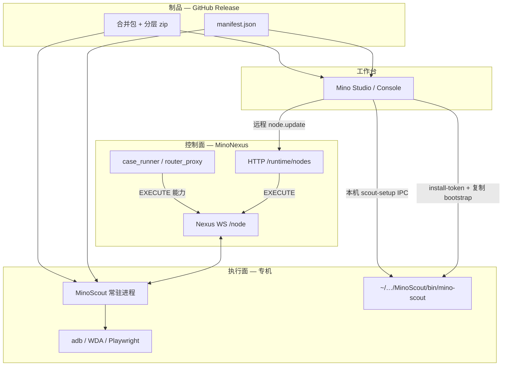

# Scout 业务与架构（Nexus 视角）

本目录描述 **MinoScout 执行节点**在 Mino 体系中的定位、安装/更新/运行框架，以及 **v0.1.28 起**的稳定行为约定。实现细节与协议字段以 [MinoScout](https://github.com/pengchengluoyi/MinoScout) 仓库为准；协议真源仍为两仓共用的 [PROTOCOL.md](../基础框架/PROTOCOL.md)。

| 文档 | 内容 |
|------|------|
| [01-定位与系统边界.md](01-定位与系统边界.md) | Scout / Nexus / Studio / 设备四者分工；硬约束与数据流 |
| [02-安装与分层产物.md](02-安装与分层产物.md) | 安装根目录、三层 zip、指纹、`layers.txt`、bootstrap |
| [03-更新链路.md](03-更新链路.md) | 本机 / 远程 / 热更 / 全量；`MINO_SCOUT_UPDATING`、reexec、回滚 |
| [04-协议与节点生命周期.md](04-协议与节点生命周期.md) | WebSocket、`node.update`、进度事件、心跳与离线 |
| [05-Studio与运维.md](05-Studio与运维.md) | Studio 安装 UI、远程更新可见性、CLI、常见故障 |
| [06-执行能力与Web槽位.md](06-执行能力与Web槽位.md) | executor、Playwright 槽位与并发预期 |

**版本锚点**：下文「当前实现」指 **Scout ≥ v0.1.28**（`RUNTIME_ABI=3`、`runtime.lock` 指纹、进程内热更不再自杀）。

---

## 一图总览

**铁律（与 CLAUDE.md 一致）**：

- Nexus **不托管** Scout 安装包；流量走 **GitHub**（或节点 `config.json` 里的 `manifest_url`）。
- Nexus **不直连设备**；一切 adb/Playwright 动作经 **Scout**。
- 循环代码只认 `router.dispatch(...)`，**不出现**「连 Scout」的分支。

---

## 与其它文档的关系

| 主题 | 本目录 | 更细的契约 |
|------|--------|------------|
| 协议字段 | [04-协议与节点生命周期.md](04-协议与节点生命周期.md) | [PROTOCOL.md](../基础框架/PROTOCOL.md) |
| 派单与 node_id | [04-协议与节点生命周期.md](04-协议与节点生命周期.md) | [NODE_REGISTRY.md](../基础框架/NODE_REGISTRY.md) |
| Studio 安装步骤 | [05-Studio与运维.md](05-Studio与运维.md) | MinoStudio `docs/SCOUT_INSTALL.md` |
| HTTP 节点 API | [05-Studio与运维.md](05-Studio与运维.md) | [HTTP.md](../基础框架/HTTP.md) |
