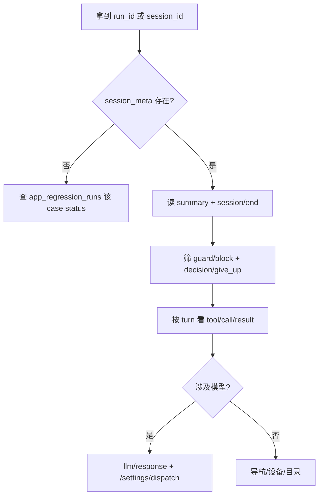

# 常见问题排查

按「现象 → 在 log 里看什么 → 常见根因 → 处理方向」组织。更细的专题复盘见 `docs/9月*` 系列与 [CASE_RUN_FIXES.md](../CASE_RUN_FIXES.md)。

---

## 1. 死循环 / 空转 / 步数耗尽

### 1.1 现象

- 同屏反复 `tap_element` / `swipe_direction` / `wait_ms`
- `session/end` 或 give_up 提到 **熔断**、**动作模式**、**连续 N 次无进展**
- `turn/end` 很多但 `case_step` 不变

### 1.2 Log 特征

| type | 字段 |
|------|------|
| `guard/block` | `guard_id` = `action_fuse` 或 `rewritten_cap` = `action_fuse` |
| `guard/block` | `skip_repeat_swipe_stuck` / `skip_repeat_structural_cap` |
| `turn/end` | `decision_status` = `skipped`，`decision_cap` 为 guard 名 |
| `ops/guard_summary` | `guard_block_counts`、`fuse_state_tail` |
| `progress/stop` | 前置 `prep_guard_streak` 过高 |

### 1.3 常见根因

1. **目标已在屏上但未 `signal_done`**：do 阶段空滑、空点；看 `require_do_work` 与 `step_effect` 探针是否未命中。
2. **滑动执行成功但业务无变化**：如风格条选中态无 probe（横滑 pass 但校验未进）；模型盲滑直到 `action_fuse`。
3. **守卫与模型对抗**：guard 拦 capability → 模型换同类动作 → 再拦（登录 scope、BACK 语义等）。
4. **前置 session 与屏态不一致**：prep 反复 `require_session` skipped，见 §3。
5. **导航原地打转**：`fsm_navigate` declined 后仍重复同参数 navigate，或 BACK/Tab 与路线图不一致。

### 1.4 处理方向

- 读 **连续 3～5 个 turn** 的 `context/slots`（goal、session_block）+ 同 turn `tool/result`。
- 若 `action_fuse`：先判断是 **真卡住** 还是 **应 signal_done / 进 check**；改 prompt（Jobs `agent-decide`）或改 case 预期 / 探针。
- 调整 case：减少模糊「滑动直到…」；校验步骤写清可 VLM 判定的信号。
- Atlas：深页无底栏时补 BACK 边或直点 Tab（`fsm_navigate` D1-C 降级文案）。

相关代码：`action_fuse.py`、`registry.py` guards、`step_effect.py`。

---

## 2. 模型思考与动作不一致

### 2.1 现象

- thought 写「本步完成 / signal_done」，实际 `tool/call` 仍是 tap/swipe
- 或相反：该点登录却去滑屏

### 2.2 Log

- `guard/block` → `block_mutate_when_thought_done`
- `llm/response` 里 `parsed.status` vs `action.capability_id`

### 2.3 处理

- 升级/校对 Jobs 模板（`agent-decide` v16+ 等对 swipe、收工语义有约束）。
- 看是否被 guard 改写 capability（`rewritten_cap`）。

---

## 3. 前置登录态死锁（logged_in vs 登录页）

### 3.1 现象

- 前置要求 **已登录**，屏在 **登录页**；`session=unknown` 或 guest
- `require_session` 在 prep 的 `signal_done` 上 skipped
- 日志里若还有 `block_login_flow_unless_step_scope`，说明进程还是旧的。这条守卫已移除，它会把本该登录的步骤连续拦截停掉

### 3.2 Log

- `inspection/done` → `session_block`（`required=logged_in`）
- `guard/block` → `require_session`
- `decision/give_up` 概括「无法完成前置」

### 3.3 根因

- **用例矛盾**：前置写已登录，步骤却 logout→再登录；prep 不允许走登录链。
- **设备实际未登录**；点「我的」进登录页。
- 登录页 **inspect 无法判定** logged_in → `unknown`。

### 3.4 处理

- 改 case 前置为 **guest** / **relogin** 场景，或拆用例。
- 设备上手动登录 / 清号池 / `clear_app_cache` 后重跑。
- 代码策略：`step_flow_scope.py`、`session_ensure.py`（产品向，非纯 bug）。

---

## 4. `fsm_navigate` declined / 导航降级

### 4.1 现象

- `tool/result` status `declined`；summary 含「规划 N 步」「无底栏」「首 hop 非返回边」「D1-C」
- `nav/attempt` 里 `degrade_level`、`plan_error`

### 4.2 处理

- 深栈先 `press_key BACK` 或直点底栏 Tab（hierarchy 可见时）。
- 修 Atlas 边与 Tab 状态绑定（目标页 id 与「灵感/造物」文案错位）。
- 见 [9月16日-用例执行调用fsmnavigate能力异常.md](../9月16日-用例执行调用fsmnavigate能力异常.md)、[NAVIGATION_ATLAS.md](../NAVIGATION_ATLAS.md)。

---

## 5. 能力路由 / Scout 错误

| 现象 | Log / 错误 | 方向 |
|------|------------|------|
| 能力目录里没有 cap=… | `tool/result` fail；`NoRouteError` | 目录缺项；或 **本应在 Nexus 本地** 的 cap 误发 Scout（如历史 `signal_done`） |
| 无可用实现 / 无节点 | router_proxy；`session/end` 早停 | Scout 未连、`/runtime/nodes` 无设备；见 [NODE_REGISTRY.md](../NODE_REGISTRY.md) |
| DeviceBusy 409 | HTTP 层；case 未开 session | 同 SN 并发跑批；retry 需等设备释放 |
| EXECUTE 超时 | `tool/result` fail | Scout 日志；设备卡死、ADB 断连 |

本地 executor（不出网）：`wait_ms`、`assert_visual`、`fsm_navigate`、`signal_*` 等，见 `router_proxy.LOCAL_CAPS` / `LOCAL_CAP_PREFIXES`。

---

## 6. LLM 401 / 未配置 provider

### 6.1 现象

- `llm/response` 缺失或 turn 极短；dispatch 里 HTTP 401
- 任务 summary：未配置 / case_execution_use

### 6.2 处理

- Console：**设置 → AI Provider**，勾选「允许跑用例」，保存 key。
- 环境变量覆盖：`MINO_AI_API_KEY` 等（见根目录 `CLAUDE.md` §8）。
- **勿**用会向真实 `mino.db` 写入的测试脚本；key 被占位符污染时需 UI 重存。

---

## 7. 校验阶段问题

| 现象 | 看 |
|------|-----|
| 操作做了但 case fail | `check` phase 的 `assert_visual` `tool/result` |
| 未写预期 | `session/end` status `unverifiable` |
| 操作阶段误调 assert | `guard/block` `block_assert_in_do` |

---

## 8. 多设备 / 重试失败

- **coverage=once** 且多 SN：历史版本可能全挤第一台；现 `case_runner` 分片 + 每设备线程（见 [NODE_REGISTRY.md](../NODE_REGISTRY.md)）。
- **retry-failed**：新 `run_id`；用新任务 ID 查 `session_meta`，不要只盯旧 `cr-…`。
- 号池 **租约** 在 run 级：并行多 case 抢同一账号时需看 `lease_account` 与号池配置。

---

## 9. 推荐排查流程（5 分钟）

1. `session_meta` → 一句话 summary。  
2. `guard/block` 计数与最后几条 reason。  
3. 最后一个成功 `tool/result` 与失败/declined 对比。  
4. 需要改 prompt 再拉 dispatch；需要改图拉 `nav/attempt` + Atlas。  
5. 修代码/配置后 **重启 Nexus**（与 Scout 版本对齐），避免 catalog/guards 未加载。

---

## 10. 文档与代码索引

| 主题 | 文档 / 代码 |
|------|-------------|
| Event 设计 | [9月8日_Session_Event_Log.md](../9月8日_Session_Event_Log.md) |
| SQL 片段 | [CASE_RUN_FIXES.md §3.3](../CASE_RUN_FIXES.md) |
| 数据表总览 | [DATA_MODEL.md](../DATA_MODEL.md) |
| HTTP | [HTTP.md](../HTTP.md) |
| Guards 注册 | `mino_nexus/loop/registry.py` |
| 熔断 | `mino_nexus/loop/action_fuse.py` |
| Guard 诊断字段 | `mino_nexus/loop/ops_guard_diag.py` |
