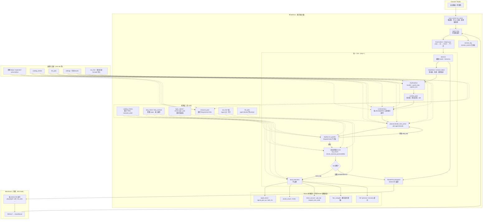
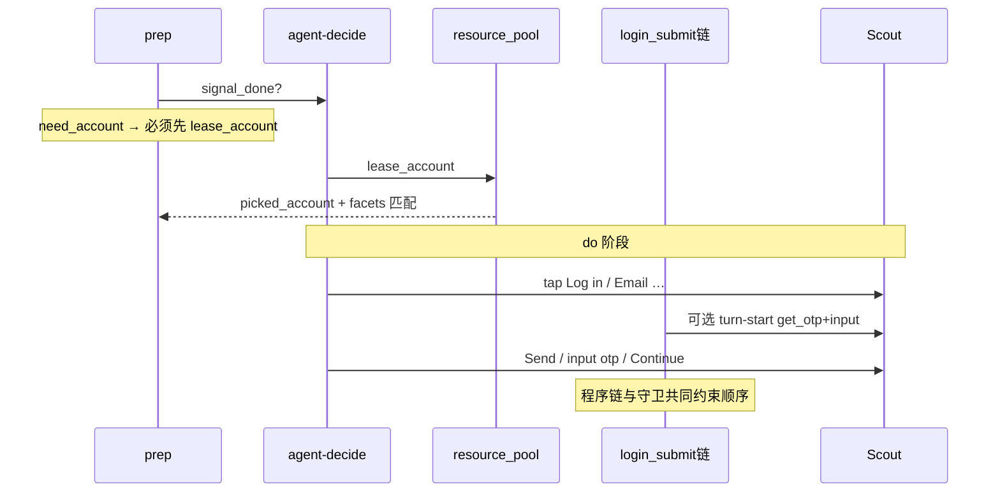

# 单用例执行全景（V1）

> **目的**：用一张总图 + 分层说明，回答「谁在决策、谁在执行、什么是配置、什么是模型、什么是 Scout、Android/Web 如何分流、单步意图与预期如何判定」。  
> **代码主入口**：`case_runner` → `agent_loop.run_case_loop` → `RouterProxy` / `local_executors` / `planner.decide_next_action`。  
> **轨迹真源**：`session_events` + `session_meta`（见 [排查手册/01-Session-Log与数据库.md](../../排查手册/01-Session-Log与数据库.md)）。

---

## 1. 一张总图（从启动到步骤结束）

下图把 **任务调度、单用例 Turn 循环、决策来源、执行出口** 画在同一张图上。实线 = 每轮必经；虚线 = 条件分支。



### 1.1 图例：四类「决策输入」

| 标记 | 含义 | 典型位置 |
|------|------|----------|
| **配置真源** | 人/Console 写入，跑批只读 | 用例正文、`catalog_entries`、`llm_jobs`、`settings`、号池 facets、`nav_fsm*` |
| **规则推导** | 代码 + 配置，不调用 LLM | `step_intent`、`run_guards`、`login_*` 程序链、`resource_pool.match`、Web enrich |
| **LLM** | `agent-decide` / `assert_visual` / `inspect_session` 等 job | `planner.py`、`llm_client` |
| **Scout 事实** | 设备侧执行与采集结果 | 截图、hierarchy、点击/输入 RESULT |

**铁律（与 CLAUDE.md 一致）**：循环里只认 `router.dispatch(event, ctx)`；**不出现** `if scout_connected`。网络在 `RouterProxy`。

---

## 2. 任务级：谁启动、谁跑一条用例

| 步骤 | 模块 | 做什么 |
|------|------|--------|
| HTTP 启动 | `routers` case-runner | 收 App、设备 sn、case 列表、env |
| 调度 | `case_runner.run_cases` | 生成 `run_id`、占设备、后台线程 |
| 单条用例 | `agent_loop`（或 explore 变体） | `open_session` → 多 Turn → `session/end` |
| 上下文 | `build_run_context` | sn、platform、租号、case_scene、target_package/url |
| 结束 | `persist_run_finish` | 批次状态、释放 Web 设备等 |

每条用例的 `session_id` 通常为 `run_id::case_id::sn`。

---

## 3. 步骤模型：prep → do → check

`StepCursor`（`step_pointer.py`）把用例拆成 **前置 + N 个操作步**，每步再分阶段：

```
用例
├── precondition  →  phase=prep   （只做租号/清缓存/设备筛选等，禁止做步骤 instruction）
├── step[1].instruction → phase=do    （操作：点、滑、输入…）
├── step[1].expected    → phase=check （校验：assert_visual，禁止 mutate 改界面）
└── step[2] …
```

| 阶段 | 能力菜单 kind（默认） | 模型目标 | 程序侧收工 |
|------|----------------------|----------|------------|
| **prep** | prep + generic + recovery | `signal_done` 表前置完成 | `prep_resource_gate_issues`、`require_session`、**须 `lease_account`（need_account）** |
| **do** | do + generic + recovery | 选 mutate cap 或 `signal_done` | 意图达成、`login_flow_do_may_finish`、探针命中、熔断 |
| **check** | check | `assert_visual` | 通过 → `signal_done` 进步 |

**prompt 里的 checkpoints_block** 由 `StepCursor` 拼装：当前 phase、只做第 n 步、达成信号延后到 check 等（见 `step_pointer` 常量文案）。

---

## 4. 单 Turn 内处理顺序（与代码一致）

以下为 `agent_loop` 一轮决策的**逻辑顺序**（省略恢复宏、登录 turn-start 链等分支）：

1. **observe**：`RouterProxy.observe` → Scout 截图 + hierarchy（Web 多为 Playwright a11y JSON）。
2. **inspections**：前置/登录态提示、`session_block` 写入槽位。
3. **NavRuntime**：`localize`、导航守卫 `check`、可选 `capture_turn` 落盘 `~/.mino-nexus/nav/`。
4. **context_pack**：知识库 / 文档检索（规划真源见 AppIntel 文档）。
5. **menu**：`available_capabilities(phase, platform, connectivity)` ← **catalog YAML**。
6. **Turn 开头程序链**（条件）：登录界面 `try_lease_on_login_surface`；`login_post_sms_pending` 时 `run_post_sms_login_pipeline`；邮件守卫 remediate 等。
7. **LLM**：`decide_next_action` → `AgentDecision`（cap + params + thought）。
8. **Guards**：`run_guards(phase_cfg.guards)` → 可改写为 `skip_cap` / 熔断 `action_fuse`。
9. **enrich**：Android：`tap_enrich` + 可选 VLM 坐标；**Web**：`device_execute_params.prepare_device_execute_params`（千分坐标、`web_coordinate_only`）。
10. **dispatch**：`is_local_cap` → `local_executors`；否则 `RouterProxy.dispatch` → Scout `EXECUTE`（须带 `executor_order`、`low_level`、`selected_impl`、`device_hint`）。
11. **结果消费**：写 `tool/call`、`tool/result`；更新 `history`、`step_intents_done`、登录/post-tap 钩子、**ProgressGate 步数预算**。
12. **signal_done 路径**：prep gate / `require_do_work` / check 未 assert 等再决定是否真的 `finish_prep` / `enter_check` / `advance`。

---

## 5. 配置 vs 大模型 vs Scout

### 5.1 配置（跑批前写好，Nexus 只读）

| 配置 | 作用 |
|------|------|
| 用例 `precondition` / `steps` / `expected` | StepCursor 文案、意图 regex 输入、assert 期望 |
| `catalog_entries` | 能力是否存在、kind、executor 实现路径、fallback |
| `llm_jobs`（Console Jobs） | system/user prompt 模板、job id（`agent-decide` 等） |
| `settings` / 号池 | AI provider、账号 facets、租号 DSL |
| `nav_fsm*` | 导航图、logout 边、守卫（禁止硬编码 App 文案） |
| SOP `phases[].guards` / `tool_kinds` | 每阶段挂哪些门闩、哪些 cap 进菜单 |

### 5.2 大模型（在线推理）

| Job | 何时 | 输出 |
|-----|------|------|
| **agent-decide** | 每 Turn（prep/do/check） | 下一个 `capability_id` + `params` + thought |
| **assert_visual** | check 阶段 | pass/fail + 自然语言理由 |
| **inspect_session** 等 | 前置/登录态核对 | session 结论写入 `session_fact` |
| 坐标辅助 | 部分 tap（含 Web VLM 槽） | `x/y` 千分比 |

模型**不**读 Scout 代码；它只看到：缩略图、hierarchy 文本、history、menu、slots。

### 5.3 Scout（协议 EXECUTE / RESULT）

| 类型 | 示例 cap | Nexus 负责 |
|------|----------|------------|
| observe | screenshot, hierarchy | 发 EXECUTE，收图/节点 |
| mutate | tap_element, input_text, swipe, launch_app | enrich 后发 EXECUTE |
| 通道 | playwright（Web）、adb、ios_wda | `RouterProxy` 按 **sn 的 platform** 过滤 `executor_order` |

协议真源：`docs/基础框架/PROTOCOL.md` + golden fixtures。

### 5.4 Nexus 本地（四类 executor，不出设备网）

见 `router_proxy.LOCAL_CAPS` 与 CLAUDE.md §2.3：`hitl`、`vlm`（assert_visual）、`ai_persona`、`internal`，以及列在 `LOCAL_CAPS` 里的租号/OTP/FSM 等。

---

## 6. Android / Web 兼容框架

**分流轴**：`RunContext.platform` + `sn`（Web 槽位 `web…`）→ `ui_channel_from_ctx` → `UiChannel.ANDROID | IOS | WEB`。

| 维度 | Android / iOS | Web（Playwright） |
|------|---------------|-------------------|
| hierarchy | uiautomator / WDA 节点 | Playwright accessibility JSON |
| 控件语义 | `ui_sms_request`、`hierarchy_slots` | `ui_dom`（邮箱框/OTP 第二输入框） |
| 点击/输入 | 常 locator + 坐标 fallback | **当前策略：坐标为主**（`web_coordinate_only`），Nexus `enrich_web_*` 补千分 `x/y` |
| executor | adb / ios_wda | playwright |
| 菜单过滤 | `platform_gate` 隐藏不可用 cap | 同左 |

**原则**：Nexus **不** import adb/playwright；所有设备动作经 `RouterProxy`。

Web 专项说明见 [排查手册/05-适配Web网页.md](../../排查手册/05-适配Web网页.md)、[基础框架/WEB_VLM_SCREENSHOT.md](../../基础框架/WEB_VLM_SCREENSHOT.md)。

---

## 7. 单步骤「意图」如何识别与收工

意图层在 **do 阶段** 用于回答：「instruction 里的业务动作是否做完」，避免纯数 tap 次数。

| 机制 | 模块 | 说明 |
|------|------|------|
| 意图集合 | `step_intent.instruction_required_intents` | 对 instruction 做 regex → `login_entry`、`nav_tab`、`input_fill`… |
| cap → 意图 | `_CAP_INTENT` | 如 `lease_account` → `account_lease`，`input_text` → `input_fill` |
| tap 补标 | `mark_tap_intents_from_instruction` | 某些意图「点一下就算」 |
| 结构 cap | `accept_legal_consent`、`request_sms_code` | 记入 `step_structural_caps_done` |
| 登录专链 | `login_submit`、`email_login_auto` | 发码→OTP→Continue；与守卫 `block_repeat_*` 配合 |
| 收工判定 | `StepCursor.try_auto_finish_do_when_intents_met` | 意图齐 + `login_flow_do_may_finish`（「完成登录」还须 session 结论） |
| 动作族 | `step_contract.step_actions_satisfied` | 无显式意图时 fallback：是否做过 tap/input/swipe 族 |

**重要**：`expected` 文案在 do 阶段通常 **延后到 check**（`_expected_defers_to_check`），do 里只用 **弱探针**（`step_effect.probe_expected_for_do`）给提示，**不**替代 assert_visual。

---

## 8. 预期（expected）如何处理

| 阶段 | 行为 |
|------|------|
| **do** | instruction 是操作目标；expected 多数只作「达成提示」或 probe，防止模型提前 assert |
| **check** | 强制 `assert_visual`（VLM）；`enrich_assert_expectation` 可附 session/登录上下文 |
| **失败** | check fail → 用例该步 fail；summary 进 `session_meta` |

登录相关 expected 会拼 `assert_session_context`，避免「屏上有登录按钮却判已登录」。

---

## 9. 守卫（Guards）与熔断

- **配置**：SOP phase 的 `guards: [...]` 列表。
- **实现**：`loop/registry.py` 各 `_guard_*`，经 `dispatch_gate.evaluate_guards`。
- **与 LLM 关系**：在 **dispatch 前** 拦截；返回 reason → 本 Turn `skip_cap`，并写 `guard/block`。
- **ProgressGate**：do 阶段步数预算（里程碑熔断 `action_fuse`），与 guard 独立计数。

Web 邮箱登录相关守卫示例：`block_repeat_email_tab`、`block_repeat_continue_submit`、`require_otp_before_login_tap`（见 registry）。

---

## 10. 登录 / 租号横切（Hi3D 类用例）



当前实现是 **「LLM 逐步 + 程序链补丁 + 守卫」**，尚未收敛为单一显式 FSM；排查时以 `session_events` 按 Turn 还原为准。

---

## 11. 和旧文档的关系

| 文档 | 关系 |
|------|------|
| [基础框架/ARCHITECTURE.md](../../基础框架/ARCHITECTURE.md) | Nexus/Scout 边界、RouterProxy 四层 |
| [基础框架/CAPABILITY_CATALOG.md](../../基础框架/CAPABILITY_CATALOG.md) | 能力 YAML 真源 |
| [基础框架/PROMPTS.md](../../基础框架/PROMPTS.md) | llm_jobs |
| [更新日志/9月18日-MinoNexus从启动到用例结束-能力汇报.md](../../更新日志/9月18日-MinoNexus从启动到用例结束-能力汇报.md) | 飞书友好逐步叙述（本 V1 图与之互补） |

---

## 12. 排查时怎么用这张图

1. 定 `session_id` → 查 `turn/start`、`llm/response`、`guard/block`、`tool/call|result`、`turn/end`。
2. 看 **phase**（prep/do/check）与 **decision_cap** 是否匹配步骤设计。
3. 区分：**guard skip**（未下发 Scout） vs **tool fail**（Scout 已执行）。
4. Web 登录：核对 `input_text` 是否带 `x/y`；Continue 是否在 OTP **之后**。

---

**文档版本**：V1（2026-03-23）· 与当前 `mino_nexus/loop/agent_loop.py` 行为对齐；后续若收敛 Web 登录 FSM，在本目录升 V2 并改 §10 序列图。
