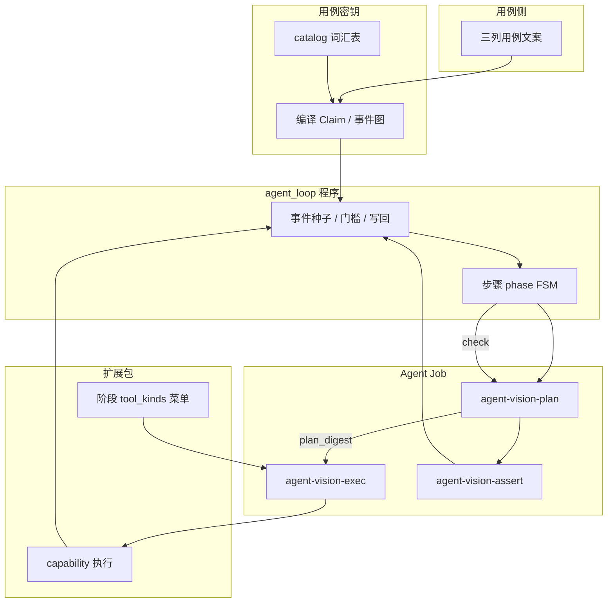

# V2：用例密钥 × 扩展包 × Agent Job 协作模型

> **状态**：方案（P6 及后续改造的真源之一）  
> **关联**：[看图规划-执行与步骤状态机方案.md](看图规划-执行与步骤状态机方案.md)、[执行改造方案-记忆与FSM逻辑块.md](执行改造方案-记忆与FSM逻辑块.md)、[CASE_RESOURCE_KEY](../../基础框架/CASE_RESOURCE_KEY.md)（词汇表：`case_resource_key_catalog.py`）

---

## 0. 为什么要单独写这一篇

V2 已拆 **看图规划 / 看图执行 / 视觉校验** 与 **步骤状态机**，但跑批仍易出现：

- 规划产出「文字检查点」，而不是可验收的**事件**；
- 前置、操作、预期对 **用例密钥** 的依赖不一致（前置偏 Claim，do/check 靠 LLM 硬解 milestones）；
- 扩展包能做什么、Job 该约束什么，边界在实现里缠在一起。

本文固定 **三方职责** 与 **协作顺序**，避免「同一概念在 Console、catalog、prompt 里各说一套」。

---

## 1. 三方分别面对谁、做什么

| 维度 | 扩展包 | 用例密钥 | Agent Job |
|------|--------|----------|-----------|
| **主要受众** | Scout / 执行器（设备与内部服务） | 用例作者、导入 Job、需求→用例生成 | 大模型（按阶段换 prompt 与输出 schema） |
| **真源位置** | 能力目录 `catalog_entries` + Console 技能 SOP `tool_kinds` | `case_resource_key_catalog.py` + 用例 `precondition` / 将扩展的 `instruction` / `expected` 密钥行 | `llm_jobs`（`agent-vision-plan` / `exec` / `assert`） |
| **核心问题** | **能做什么、怎么调** | **用例文案 ⇄ 程序事件** 的协议 | **在什么阶段、用什么规则、回什么 JSON** |
| **约束性质** | 能力边界（prep/do/check/recovery 菜单） | 验收与资源 Claim（不能漏、不能假收工） | 行为边界（单步单 cap、禁止 signal_done 收工等） |

一句话：**扩展包对执行器，用例密钥对用例，Agent Job 对模型**；三者共同目标是 **规范化执行——不该做的不做，该做的不漏**。

---

## 2. 扩展包：最小事件与「内部 CLI」

### 2.1 两类能力

1. **最小事件单元（device mutate）**  
   点击、输入、滑动、等待等。特点：**无业务判定即可执行**（参数合法即可下发 `EXECUTE`）。  
   痛点：若没有上层计划，模型会随意选 cap → 空转、重复 tap、与 Claim 无关的操作。

2. **内部程序调用（agent-loop / Nexus 本地）**  
   可视为对内部服务的 **CLI**：不经过 Scout 设备协议，或经协议但逻辑在 Nexus 算完。例如：
   - `lease_account`：按 Claim 从号池选号并写租约；
   - `fsm_navigate`：按导航图与当前屏生成到达目标屏的路径；
   - **逻辑块**（如登录流）：导航 FSM 上的结构化子图，块内步与 hook cap 由 catalog + 程序展开。

扩展包 **不负责** 解读「用例第 2 行写的是什么意思」；只声明 **id、参数 schema、kind（prep/do/check/recovery/generic）**。

### 2.2 与执行器的关系

- Nexus `agent_loop` 根据 **阶段 SOP `tool_kinds`** 生成当轮 **function menu**；
- 选中 capability 后 `RouterProxy.dispatch` → Scout；
- 四个本地 executor（HITL、VLM 断言、拟人、internal）不出网，仍属扩展包语义，但不走 `EXECUTE`。

**扩展包回答**：「这一步**允许**发哪些 cap、参数长什么样。」

---

## 3. 用例密钥：用例与事件之间的协议

### 3.1 职责

用例密钥是 **手工测试用例（三列：前置 / 操作 / 预期）与程序事件图** 之间的 **通信协议**，不是 prompt 里的自然语言复述。

| 工作 | 说明 | 现状（V2 改造中） |
|------|------|-------------------|
| **文案 → 事件** | 把编号行、结构化字段编译为 Claim、`prep_items`、里程碑 id、`hook_cap` 等 | **前置**：`precondition` → `resource_key` / `case_scene`，catalog 层级「前置」；**操作 / 预期**：仍大量依赖 `agent-vision-plan` + 单步文案 **硬解** milestones → **不确定、跑次间漂移** |
| **需求 → 可执行用例**（规划） | 生成用例时带密钥行，提高可执行率与稳定性 | **未开发**；目标是大模型写用例时即遵守密钥词汇，跑批侧程序可稳定执行一段，UI 变化再由看图纠偏 |

### 3.2 前置密钥（已落地词汇表）

见 [CASE_RESOURCE_KEY](../../基础框架/CASE_RESOURCE_KEY.md)：

- **设备登录态 / 账号登录态 / 账号与数据 / 环境与权限** → Claim 路径与登记簿；
- **prep 程序三步**：筛选账号 → 筛选设备 → 环境清理（不再做「切换测试环境」）。

密钥产出的是 **事件节点**（须 `lease_account` 成功、`clear_app_cache` 成功、机态满足 `required_session` 等），不是「检查一下账号」这类不可执行标题。

### 3.3 操作 / 预期密钥（目标，待扩展 catalog）

与前置对称，建议同样具备：

| 层级（Console） | 对应用例列 | 编译产物（示意） | 痛点 |
|-----------------|------------|------------------|------|
| 前置 | `precondition` | Claim、`prep_items`、prep 里程碑 | 已与 preflight / `prep_resource_gate` 部分衔接；**规划 Job 尚未以密钥为种子** |
| 操作 | `instruction`（每步） | `do` 里程碑 / 逻辑块引用 / 可选 Nav 目标 | 今日靠 vision-plan 自由发挥 → **根因：无稳定事件 id** |
| 预期 | `expected`（每步） | `check` 校验点（`checkpoint` kind）、程序可判定项优先 | 今日 check 部分有 `milestones_from_check_plan`；与 assert Job 应对齐 **密钥行** 而非纯 LLM 列表 |

**用例密钥回答**：「这条用例**必须达成哪些可验收事件、锁哪些资源**。」

---

## 4. Agent Job：与大模型交互的角色

### 4.1 职责

1. **分阶段 prompt**：prep / do / check 约束不同——前置偏资源与 prep 事件；操作偏单步意图与块内步；预期偏校验点清单、禁止 mutate。  
2. **约束输出 schema**：只返回约定 JSON（`plan_digest`、`AgentAction`、assert 结果等），程序写回里程碑与 phase，**不认** `signal_done` 收工（SOP `advance_on: milestones`）。

### 4.2 三个运行时 Job（P6）

| Job | 阶段 | 输入侧重 | 输出 | 可调扩展包？ |
|-----|------|----------|------|--------------|
| `agent-vision-plan` | prep / do / check | 截图 + **本阶段密钥编译计划** + 当前事件进度 | `plan_digest`、（程序已种子时的）里程碑更新意图、`flow_block_ops` | **否**（不下发 device cap） |
| `agent-vision-exec` | prep / do | `plan_digest` + `active_milestone` + **menu（扩展包）** | **单条** `AgentAction` | **是**（仅 menu 内） |
| `agent-vision-assert` | check | 预期密钥 + 校验点 JSON + 截图 | pass/fail、evidence | **否**（批量断言） |

Job **不替代** 密钥编译，也 **不扩展** 扩展包目录；只在 **密钥与程序已给出的事件队列** 上，做 **对齐屏面、填参、纠偏**。

**Agent Job 回答**：「这一轮模型**只能**在什么前提下、填什么结构化结果。」

---

## 5. 三者如何协作（执行主路径）

### 5.1 总览

### 5.2 单轮 turn（prep / do）

| 顺序 | 主体 | 动作 |
|------|------|------|
| 1 | **用例密钥 + 程序** | 若本 phase 事件图为空 → **程序种子**（前置：prep_flow + Claim；do：将扩展为 instruction 密钥；check：expected → checkpoints） |
| 2 | **程序** | `evaluate_milestones`、硬门槛（如 `prep_resource_gate`）、菜单过滤（如未清缓存隐藏 `launch_app`） |
| 3 | **agent-vision-plan** | 读截图 + **事件图与 active 节点**；输出 `plan_digest`（意图、hints），**不发明**与密钥无关的新事件 |
| 4 | **agent-vision-exec** | 在 **扩展包 menu** 中选 **一个** cap，填参执行 |
| 5 | **程序** | `tool/result` → 更新里程碑 / 租约 / 机态；`try_transition_after_tool_pass` / FSM 流转 |

### 5.3 check 轮

| 顺序 | 主体 | 动作 |
|------|------|------|
| 1 | **用例密钥** | `expected` 行 → 校验点事件（程序 + 未来将扩展 catalog） |
| 2 | **agent-vision-plan** | 对齐屏面与校验点（必要时调整 checkpoint 描述，**不**改 Claim） |
| 3 | **agent-vision-assert** | 批量视觉判定 |
| 4 | **程序** | 失败 **不翻案**；仅 recovery（扩展包 recovery kind）后可重 assert |

### 5.4 分工铁律

| 禁止 | 原因 |
|------|------|
| 扩展包内写「何时做 lease」的业务顺序 | 顺序在密钥 + prep_flow + FSM |
| 用例密钥里写 tap 坐标或包名 | 密钥只锁资源与事件类型，执行参靠看图 Job |
| plan Job 自由生成与密钥无关的 milestones 清单 | 导致 `7b16` 类「三个检查点」文案 + Google 乱点 |
| exec Job 一次返回多 cap 或 `signal_done` 收工 | 违反单步与 milestones 收工 |
| 用 prompt 替代 `resource_key` 编译 | 跑次间漂移，无法 Console 对照 |

---

## 6. 与 Console 的对应关系

| Console | 三方中的位置 |
|---------|----------------|
| **用例密钥** 页 | 密钥词汇表与层级（前置 / 操作 / 预期 / 通用）；作者与 AI 写用例的 **协议说明** |
| **技能 run-case** SOP | 每阶段 `job` / `exec_job` / `tool_kinds` / `advance_on` → 绑定 **Agent Job** 与 **扩展包范围** |
| **Jobs** | `agent-vision-plan` / `exec` / `assert` 的 prompt 与 schema |
| **扩展包 / 能力目录**（Studio） | 扩展包定义；Nexus 只读 `catalog_entries` |

跑批时 `session/start.sop_orchestration` 记录 SOP；`session_events` 中 `plan/vision`、`exec/vision`、`assert/vision` 记录 Job 轨迹；`resource/*`、`milestone/*` 记录密钥与事件写回。

---

## 7. 现状缺口与 V2 演进（对齐你的 3.1.2）

| 项 | 现状 | 目标 |
|----|------|------|
| 前置文案 → 事件 | Claim 编译 + **prep 程序种子**（`prep_program_plan`） | plan 只输出 `plan_digest` / hook 提示，不改里程碑 |
| 操作文案 → 事件 | vision-plan **硬解** milestones | 扩展 catalog **操作层** + 编译器；块/Nav 引用密钥 id |
| 预期文案 → 事件 | 部分 `milestones_from_check_plan` | **预期层**密钥 + assert 只消费编译校验点 |
| 需求生成用例 | 无密钥约束 | 生成模板带编号行；可执行率可测 |
| 稳定性 vs 智能 | 操作/预期漂移 | **密钥保证段内稳定**；UI 变化由 plan/exec **填参** 体现智能 |

实施顺序建议（仍属 P6 后续包，全仓优先级见 [命名与优先级.md](命名与优先级.md)）：

1. **P6+ 前置闭环**：✅ `seed_prep_milestones_from_claim` + `prep_program_plan` slots + `agent-vision-plan` v2。  
2. **catalog `operation | expected`** + 编译器：✅ P7 已落地（见映射方案 §6）；Studio 绑 key 仍 P8。  
3. **用例导入 / 生成 Job**（带密钥行）：**延后**，不在当前版本。  

---

## 8. 小结（对应 3.1.4）

- **扩展包**：对执行器——**能力与参数**；最小事件 + 内部 CLI（租号、导航、逻辑块）。  
- **用例密钥**：对用例——**文案 ⇄ 可验收事件与 Claim**；前置已建词汇，操作/预期待对称扩展。  
- **Agent Job**：对模型——**分阶段 prompt + 结构化输出**；在密钥与程序事件图上做看图决策，不越权定义业务步骤。  

三者协作：**密钥（+程序）定事件图 → plan 定当前意图 → exec 在扩展包中选一步 → 程序写回并驱动 FSM**；check 走 plan + assert，密钥定校验点。

后续具体接口（slots 名、里程碑 schema、catalog 新条目）写入 [看图规划-执行与步骤状态机方案.md](看图规划-执行与步骤状态机方案.md) 或 [步骤准出与登录态方案.md](步骤准出与登录态方案.md)。
