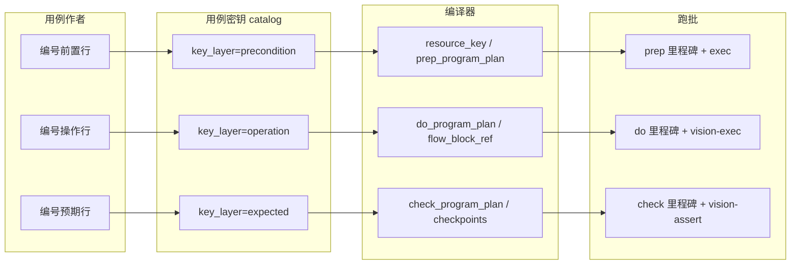

# 用例密钥：操作层 / 预期层映射方案（V2）

> 状态：**已落地（P7）** — 编译器 + 跑批种子 + Job v3；Studio 下拉绑 key_ref 仍属 P8。  
> 不包含「需求→用例生成带密钥行」（后续版本）。  
> 与 [三方协作-用例密钥-扩展包-AgentJob.md](三方协作-用例密钥-扩展包-AgentJob.md)、[用例执行-程序图专注与异常栈方案.md](用例执行-程序图专注与异常栈方案.md)、[case_resource_key_catalog.py](../../mino_nexus/services/case_resource_key_catalog.py) 对齐。

---

## 1. 目标

| 层 | 人类写法 | 程序产物 | 执行阶段 |
|----|----------|----------|----------|
| **前置** `precondition` | 编号行「设备/账号/环境…」 | `resource_key` + **prep 里程碑**（已闭环） | prep |
| **操作** `operation` | 编号行「操作：…」 | **do 事件图**（块 / cap 序列 + 可选 Nav 目标） | do |
| **预期** `expected` | 编号行「预期：…」 | **check 校验点**（checkpoint / assert 载荷） | check |

原则与前置一致：**密钥定事件图骨架**；`agent-vision-plan` 只在骨架上填 `plan_digest`（当前屏、跳过、参数提示），**不得**用自由 `milestones[]` 重写业务步骤顺序。

---

## 2. 三层对称模型



---

## 3. 操作层（operation）——建议映射

### 3.1 编号行 → catalog 条目

- 格式与前置相同：**`n. 操作：{自然语言}`** 或 **`n. {动词短语}`**（Console 规范与 `parse_numbered_items_rules` 一致）。
- 每行编译时尝试：
  1. **精确匹配** catalog `write_examples` / `dsl` 模板；
  2. **结构化片段**：`【块:{block_id}】`、`【导航:{screen_id}】`、`【cap:{capability_id}】`（作者可选，生成器优先输出）；
  3. **兜底** `operation.generic`：记 `raw_text` + `intent_tags[]`，do 阶段仍走 vision-plan，但 **不写入程序种子**（可观测 `source=llm_fallback`）；须附带 **建议补充的 key**（见 §7.2）。

### 3.2 一行 → 多 step（`operation.compound`）

- **允许且为常态**：一条编号操作行编译为 `do_program_plan.steps[]` 的 **多条** 子里程碑，才符合「一块 / 一 Nav / 一 hook」粒度。
- 拆分规则（编译器按序应用）：
  1. 作者显式子句：`；` / `。` / 换行 / 并列「并」「然后」等切分；
  2. 单条 catalog `key_ref` 若 DSL 声明 `expands_to: [step, …]`，按声明顺序展开；
  3. 匹配到 `flow_block` 时，块内步骤由 `milestones_from_flow_steps` 展开，**不再**与行内其它 key 混为一步。
- `steps[].source_line` 可相同（同一编号行）；`steps[].subclause_index` 保留子句顺序。

### 3.3 编译产物：`do_program_plan.v1`

与 `mino.prep_program_plan.v1` 同形，挂在 **case_step × phase=do**：

```json
{
  "schema": "mino.do_program_plan.v1",
  "case_step": 1,
  "steps": [
    {
      "id": "do_s1_open_cart",
      "key_ref": "operation.open_shopping_cart",
      "title": "打开购物车",
      "kind": "nav",
      "nav_target": "screen_cart",
      "optional": false
    },
    {
      "id": "do_s1_add_sku",
      "key_ref": "operation.add_first_item",
      "title": "将第一件商品加入购物车",
      "kind": "flow_block",
      "block_id": "block_add_to_cart",
      "optional": false
    },
    {
      "id": "do_s1_tap_checkout",
      "key_ref": "operation.tap_checkout",
      "title": "点击去结算",
      "kind": "hook",
      "hook_cap": "fsm_navigate",
      "hook_params": { "edge_hint": "to_checkout" },
      "optional": false
    }
  ]
}
```

**kind 枚举（第一版）**

| kind | 含义 | exec 侧 |
|------|------|---------|
| `flow_block` | 逻辑块展开 | `milestones_from_flow_steps` + `flow_block_ops` |
| `nav` | NavFSM 目标屏 | `fsm_navigate` / guard 已到位则 skip |
| `hook` | 单 cap | `agent-vision-exec` 选 hook_cap |
| `visual_action` | 无块、纯 UI | plan 只写 digest；里程碑 id 固定，exec 逐步 |
| `internal` | 程序判定 | 如「已在前台」→ inspect 通过即 pass |

### 3.4 与现有结构的关系

- **一条用例步骤**（`instruction` 内一个编号）→ **一个 `do_program_plan`**（多步子里程碑）。
- **逻辑块**（`nav_flow_block_catalog`）可被多个 `key_ref` 引用；块内步骤不再重复出现在 catalog。
- **Nav `screen_id`** 与 Studio 导航图一致；禁止在编译器里硬编码 App 文案（见仓库 `no-app-keywords` skill）。

### 3.5 plan / exec 分工（do）

| 组件 | 允许 | 禁止 |
|------|------|------|
| `seed_do_milestones_from_plan` | 从 `do_program_plan` 写入 `success_criteria.milestones` | — |
| `agent-vision-plan` | `plan_digest`、`flow_block_ops`（skip/insert）、`hook_calls` 参数提示 | 覆盖已种子 `milestones[]` 顺序与 id |
| `agent-vision-exec` | 当前 pending 子里程碑对应 **一步** cap | 一次多 cap、signal_done |

---

## 4. 预期层（expected）——建议映射

### 4.1 编号行 → catalog 条目

- **`n. 预期：{可观察结论}`** 或 check 段整段 `expected` 字段按行拆分。
- 编译为 **`check_program_plan.v1`**，与现有 `milestones_from_check_plan` / `build_check_plan` 合并演进：

```json
{
  "schema": "mino.check_program_plan.v1",
  "checkpoints": [
    {
      "id": "ck_cart_count",
      "key_ref": "expected.cart_item_count",
      "title": "购物车数量为 1",
      "kind": "checkpoint",
      "assert": {
        "mode": "vlm",
        "expectation": "购物车角标或列表显示 1 件商品"
      }
    },
    {
      "id": "ck_price_visible",
      "key_ref": "expected.price_displayed",
      "title": "展示应付金额",
      "kind": "checkpoint",
      "assert": { "mode": "hierarchy", "selector_hint": "..." }
    }
  ]
}
```

### 4.2 与 `agent-vision-assert` 的关系

- 程序种子 `kind=checkpoint` 里程碑（**已有** check 路径）。
- `agent-vision-plan`（check 阶段）只输出 `checkpoints_plan` **对齐已有 id**，或标注 `blocking`；不新增匿名校验点。
- `agent-vision-assert` 批量消费 `checkpoints_plan` + **check 阶段当前截图**（及 inspect 槽），依据 `check_program_plan` / `expected` 密钥编译的 assert 载荷。
- **与 do 隔离（硬约束）**：check **不得**读取或引用 do 阶段的 `plan_digest`、`vision_plan_digest`、do 里程碑执行轨迹或「上一步操作规划」作为断言依据。操作改变界面；预期验证结论——职责不同，即使同屏也各自独立上下文（见 §7.3）。

### 4.3 预期密钥类型（catalog 建议分类）

| 类型 | `dsl` 示例 | 编译到 assert |
|------|------------|----------------|
| `ui_text` | `文案包含：{text}` | VLM expectation 模板 |
| `ui_state` | `session=logged_in` | `inspect-session` + 规则 |
| `counter` | `数量={n}` | VLM + 可选 hierarchy |
| `navigation` | `当前屏={screen_id}` | Nav 定位 + checkpoint |
| `data` | `账号字段.{facet}={value}` | 租约 facets / 只读 API |

---

## 5. 存储与真源

| 数据 | 落点 | 说明 |
|------|------|------|
| 词汇表 | `case_resource_key_catalog.entries` + `key_layer` | Console 只读展示 |
| 用例机读 | `case.meta.resource_key`（前置已用） | 扩展 `operation_plan[]` / `expected_plan[]` **或** 独立 `case.meta.step_keys[{n}]` |
| 跑次只读 | `cursor.do_program_plan` / `check_program_plan` | 与 `prep_program_plan` 同模式 |
| 可观测 | `session_events`: `milestone/program_seed`, `plan/vision`, `key_compile/fallback` | 含 `source=prep_claim|do_keys|check_keys`；fallback 标红 + `suggested_keys[]` |

**推荐（V2.1）**：不扩大 `resource_key` 顶层混乱，新增：

```json
"case.meta.step_program_keys": {
  "1": { "operations": ["operation.open_cart", "..."], "expected": ["expected.cart_item_count"] },
  "2": { ... }
}
```

编译器在 case 保存时从编号行生成；跑批时按 `case_step` 解析为 `*_program_plan`。

---

## 6. 编译器流水线（实施状态）

| 阶段 | 状态 | 代码 / 接口 |
|------|------|-------------|
| P6+ prep | ✅ | `loop/prep_program_plan.py` |
| P7 catalog + 编译 | ✅ | `case_resource_key_catalog` v3；`case_step_key_compiler.py`；`save_case` 自动编译 |
| P7 跑批种子 | ✅ | `do_program_plan.py` / `check_program_plan.py`；`milestone/program_seed`；`key_compile/fallback` |
| P7 Job | ✅ | `agent-vision-plan` v2（prep）+ v3（do/check） |
| P7 HTTP | ✅ | `POST /project/{id}/cases/{case_id}/step-keys/compile` |
| P8 Studio / 导入 | ✅ | 逻辑块 `key_ref` + 屏幕密钥 Tab；`step_key_validation` 预览；`block_on_step_key_issues` 提交 |

---

## 7. 已定决策

### 7.1 一行操作 ↔ 多块 / 多 step

**允许；多 step 才是正确建模。** 一行编号操作应优先编译为多个 `do_program_plan.steps`（§3.2），顺序等于子句或 `expands_to` 顺序，而非强行压成单个里程碑。

### 7.2 无密钥兜底（`operation.generic`）

- **不强制**作者在首版就补 key（不拦保存、不拒跑）。
- **必须可见地提示补 key**：
  - **保存 / 编译**：`case.meta.key_compile_warnings[]`，每项含 `line`、`raw_text`、`suggested_key_refs[]`（建议新增的 `operation.{id}` + 建议 `write_examples` 草案，可由 catalog 模糊匹配或规则/Job 生成）。
  - **跑批**：`session_events` → `key_compile/fallback`（`telemetry: red`），便于 Console / 报表筛「未密钥化的操作行」。
- 兜底行仍 `source=llm_fallback`，不写入程序种子里程碑；稳定化路径是作者采纳 `suggested_key_refs` 后写入 catalog 并回写用例。

### 7.3 预期 vs 操作（check 不得用 do 的 plan_digest）

- **禁止** check 阶段使用 do 的 `plan_digest` 快照（以及 do 专用规划上下文）做断言或规划输入。
- check 只消费：**本步 `expected` 文案**、`check_program_plan`、程序种子的 checkpoint 里程碑、**check 阶段截图 / hierarchy**（与 P6 `agent-vision-assert` 一致）。
- 同屏仅表示「操作后界面可供目检」，**不**构成把 do 规划结果传给 assert 的理由。

---

## 8. 小结

- **操作层** → `do_program_plan` + 子里程碑（块 / Nav / hook / visual）；plan 只纠偏，exec 单步。  
- **预期层** → `check_program_plan` + checkpoint 里程碑；assert 批量、id 稳定；**与 do `plan_digest` 零耦合**。  
- **compound** → 一行多 step；**fallback** → 警告 + 建议 key + telemetry 标红。  
- **与前置对称**：catalog 真源、编译器出 plan、vision Job 不抢写骨架。  
- **明确不做**：本方案不包含需求→用例自动带密钥行（后续 Job + catalog 覆盖率达标后再开）。
