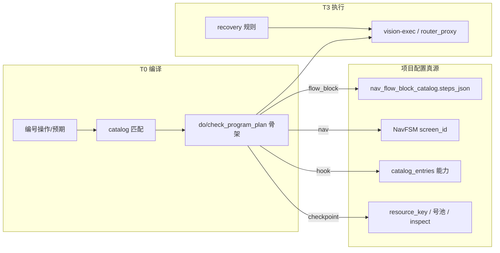

# 用例执行：程序图、专注与异常栈（V2）

> **状态**：方案（2025-09 沟通沉淀）；**P1 已落地**；**P2 已落地（Nexus 侧）** — 见 §11 勾选说明  
> **关联**：[用例密钥-操作与预期映射方案.md](用例密钥-操作与预期映射方案.md)、[里程碑-Plan-Exec-状态机.md](里程碑-Plan-Exec-状态机.md)、[看图规划-执行与步骤状态机方案.md](看图规划-执行与步骤状态机方案.md)、[执行改造方案-记忆与FSM逻辑块.md](执行改造方案-记忆与FSM逻辑块.md)

---

## 0. 这次沟通要解决的问题

跑批时 vision-plan / vision-exec 多轮调用，体感像「和大模型连续对话」：模型被当前屏显著元素吸引（Learn More、OAuth 重复点击等），**偏离用例意图**。初步修复若只靠 **密钥文案、claim、加长 system prompt**，无法根治——因为任务边界仍在运行期由模型 **重新协商**。

本方案把方向定为：

1. **用例执行 = 跑一张（大部分在编译期闭合的）程序图**，LLM 只在「当前边」上做封闭决策（点哪、填什么、是否满足谓词），或在 **显式补洞** 时出场。
2. **前置 / 操作 / 预期** 三层密钥对称：catalog 真源、编译器出 `*_program_plan`、跑批种子里程碑；**不**为每种密钥扩 SQLite 列。
3. **意外 UI** 用分层处理（规则 recovery → 编译可选分支 → interrupt 子图 → HITL），而不是 `open=0` 时让 plan 自由 `milestones_append` 当任务作者。

下文汇总原则、流水线、超纲策略、现状差距与落地顺序。

---

## 1. 问题根因（工程表述）

| 现象 | 根因（非「模型不听话」） |
|------|-------------------------|
| prep 后 plan 追加与用例无关事件 | 观测 dominated  by 截图/层级；`success_criteria` 过瘦；**无 in_progress 约束下 plan 被门控逼着「造下一步」** |
| `goal` / `task_context` 与 exec 参数「像有关其实无关」 | 轨迹字段在 Nexus/Console 侧；**未作为 vision plan/exec 的因果输入** 时，对模型等于不存在 |
| do 像没「被测 App 逻辑」 | 编译器只做 **文本 → key_ref + kind + 指针**；业务序列在 **逻辑块 / Nav / 能力目录**，泛化 tap 无图则骨架薄 |
| 只有前置「像闭环」 | prep 有 `seed_prep_milestones_from_claim`；do 在 **agent-vision-plan** 路径下 **常不种** `do_program_plan` 里程碑（见 §8） |

**专注** 来自：运行层绑定 **当前边 id**、观测按边裁剪、**禁止** 无 program 骨架时让 plan 重写业务顺序——而不是换更大模型或把整份 case JSON 塞进 prompt。

---

## 2. 设计原则

### 2.1 三层分离

```text
编译层（Nexus，尽量无 LLM）
  用例 + 密钥 → 本 phase 的 steps[] / checkpoints[]（边列表 + 验收谓词）
运行层（状态机，程序）
  当前边、in_progress、pass/fail、何时 plan、何时 exec、何时 phase 流转
执行层（LLM 仅当边需要视觉或局部补洞）
  输入 = 当前边意图 + 裁剪观测 + 允许工具；输出 = 单步 tool / 窄 scope 的 plan diff
```

### 2.2 记忆分型

| 类型 | 内容 | 给谁看 |
|------|------|--------|
| **任务状态** | `success_criteria.milestones`、`*_program_plan` | exec、程序判定 |
| **情节记忆** | `history`、session 轨迹 | 人、窄 scope replan |
| **跑批上下文** | `RunContext`、`task_context`（若存在） | Console/排查；**默认不进** vision plan/exec 用户块 |

### 2.3 主路径闭合 + 未知可观测降级

- **100% 编译期穷举所有 UI** 不现实；目标是 **主路径闭合**，干扰 **可组合**，未知 **标红 + fallback 赛道**（见 [用例密钥 §7.2](用例密钥-操作与预期映射方案.md)）。
- 里程碑 `pass`/`failed` **仅程序** 根据 tool / inspect 写回；plan **禁止** `milestone_updates`（见 [里程碑-Plan-Exec](里程碑-Plan-Exec-状态机.md)）。

### 2.4 对内一句话

> 用例不是和模型聊天，而是执行已编译的图；模型只在当前边上答封闭问题；规划 LLM 只在图补洞时出现，且不能发明与当前 phase 谓词无关的边。

---

## 3. 三层密钥与编译（对称模型）

词汇表真源：`mino_nexus/services/case_resource_key_catalog.py`（`KEY_LAYERS`: precondition / operation / expected / generic）。

| 层 | 人类输入 | 编译器 | 落盘 | 运行时 plan |
|----|----------|--------|------|-------------|
| **前置** | 编号前置行 | `case_resource_claim` | `meta.resource_key` | `prep_program_plan`（`prep_flow` + claim 求值） |
| **操作** | 步骤 `instruction` | `case_step_key_compiler.compile_operation_text` | `meta.step_program_keys[n].do_program_plan` | `cursor.do_program_plan` |
| **预期** | 步骤 `expected` | `case_step_key_compiler.compile_expected_text` | `meta.step_program_keys[n].check_program_plan` | `cursor.check_program_plan` |

**保存用例**（`case_store.save_case`）自动：`sync_case_resource_metadata` + `sync_case_step_program_keys`。  
**手动重编**：`POST .../resource-key/compile`、`POST .../step-keys/compile`。

操作层匹配顺序（实现见 `case_step_key_compiler._match_catalog_clause`）：

1. 显式 `operation.*` / `expected.*`
2. `【块:block_id】` → `nav_flow_block_catalog` + `key_ref`
3. `【导航:screen_id】` → kind=`nav`
4. `【cap:capability_id】` → kind=`hook`
5. `write_examples` 子串互包含（最长赢）
6. `expands_to` → 一行多 step（如 `operation.open_cart`）

校验与导入：`case_key_registry.validate_case_step_keys`（未知块/屏、fallback 行）。

详细字段形状见 [用例密钥-操作与预期映射方案.md](用例密钥-操作与预期映射方案.md)。

---

## 4. 编译时机（T0–T3）

避免把「及时响应」和「重编译」绑在同一热路径。

| 阶段 | 时机 | 做什么 | 模块 |
|------|------|--------|------|
| **T0** | 保存 / 导入 / HTTP compile | 全文编译 → `resource_key`、`step_program_keys`、`key_compile_warnings` | `case_resource_claim`、`case_step_key_compiler` |
| **T1** | 进入 prep / do / check | 实例化 plan（claim 求值、读 meta、缺则按当前步文本现编） | `prep_program_plan`、`do_program_plan`、`check_program_plan` |
| **T2** | phase 内里程碑为空（或 check 仅通用种子） | `milestone/program_seed` | `seed_prep_milestones_from_claim`、`seed_do_milestones_from_plan`、`seed_check_milestones_from_plan` |
| **T3** | 每 agent turn | guard/recovery、milestone 推进、门控 plan/exec | `milestone_orchestrator`、`recovery*`、`agent-vision-*` |

**T3 不应**每轮重跑整案 `compile_case_step_program_keys`。

---

## 5. 「被测 App 程序逻辑」在哪里

编译器 **不** 理解 App 业务状态机，只生成 **引用**：



| kind | 逻辑谁维护 | 执行 |
|------|------------|------|
| `flow_block` | Studio 逻辑块步骤 | 展开 `resolve_effective_steps` → `milestones_from_flow_steps` |
| `nav` | 导航图 | `fsm_navigate` + `nav_target` |
| `hook` / `visual_action` | 能力目录 + 当屏视觉 | `agent-vision-exec` 单 cap |
| `checkpoint` | catalog assert 模板 | `agent-vision-assert` / inspect |

**预期路线** = 用例骨架 + 密钥指向的资源。缺块、缺 Nav、仅泛化「点击」→ 运行期只能靠 LLM，表现为「没有 App 逻辑」——应通过补块/导航密钥解决，而非让 plan 每轮编故事。

---

## 6. 超出 catalog / 词汇表时怎么办

**不新增 DB 列**：扩 `catalog.entries`（`write_examples`、`dsl`、`expands_to`）、扩逻辑块/Nav、或扩 `account_requirement_compile` 解析前置行。

| 层 | 匹配失败时编译结果 | 跑批 |
|----|-------------------|------|
| **operation** | 无 `steps` 行；`key_compile_warnings` + `suggested_key_refs` | 不种子 do 里程碑；`key_compile/fallback`（red） |
| **expected** | 仍生成 `source=llm_fallback` 的 checkpoint（VLM expectation=原文） | 可种子 check；同时 warning |

稳定化路径：作者采纳建议 key → 写入 catalog → 用例改写法或 `【块/导航/cap】`；Studio 可 `block_on_step_key_issues`。

---

## 7. Plan / Exec 与程序图（目标行为）

与 [里程碑-Plan-Exec-状态机.md](里程碑-Plan-Exec-状态机.md) 对齐，并 **收紧** plan 角色：

| 组件 | 目标 |
|------|------|
| **程序种子** | prep/do/check 在进 phase 时写入里程碑 **骨架**（id、key_ref、kind 稳定） |
| **vision-plan** | 只读 `*_program_plan`；输出 `plan_digest`、`flow_block_ops`（skip/insert）、`step_requirements_complete`；**不**重排已种子 id |
| **vision-exec** | 仅 `in_progress` 一条；单 cap |
| **门控** | 无 `in_progress` 不 exec；**不应**在「仅有无关 pass、open=0」时默认 plan 以发明新边 |

plan 追加时 `thought` 须「虽然…，但是…」；**禁止** plan 写里程碑终态。

---

## 8. 现状差距（已对齐）

| 项 | 落地 |
|----|------|
| do/check 程序种子 | `program_plan_seed.py` + `agent_loop` / `milestone_orchestrator` |
| plan 门控 | `open==1` 或空列表；`open==0` 走 `evaluate` + `phase/transition`；`stuck_replan` 仅 failure 审查 |
| append 约束 | do 锁 program_plan；check 对齐 checkpoint id；prep 仅验收类 append |
| interrupt | `interrupt_stack` + `interrupt_recovery`（recovery actions 优先） |

代码锚点：`vision_plan.py`、`milestone_orchestrator.py`、`interrupt_stack.py`、`interrupt_recovery.py`。

---

## 9. 意外 UI：与编译步骤不一致

主图描述 **预期主路径**，不是全世界 UI 的枚举。分三层，避免与「闭合列表」矛盾：

### 层 A — 已知干扰（程序，不改主图）

- `loop/recovery.py` + catalog recovery rules
- `system_dialog_recovery`、权限、`channel_program_recovery`、逻辑块内系统弹窗宏
- **特征**：命中即 dispatch cap，**不**改 `do_program_plan.steps` 顺序

### 层 B — 主路径可选分支（编译期进图）

- `optional: true` 步骤（可跳过营销页等）
- claim 求值跳过 `pick_account` / `env_cleanup`
- Nav guard 已到位则 skip

### 层 C — 未知表面（受控偏离）

```text
exec 当前 in_progress
  → guard/recovery 命中？→ 执行 recovery，继续主边
  → 连续 fail / fuse？→ 主边 blocked
  → 有 interrupt 模板 / flow_block？→ 压栈 short 恢复序列（interrupt_*，optional）
  → 否则窄 scope vision-plan：仅 insert 与当前边相关的恢复步
  → 仍失败 → HITL 或 fail + suggested_key
恢复步 pass → pop 子图，恢复原 in_progress
```

**语义**：与编译不一致的叫 **interrupt（打断）**，不是「改里程碑顺序」。主图 step id 尽量不变。

建议后续在 cursor/session 增加可观测字段（方案级，实现待定）：

```json
{
  "schema": "mino.interrupt_stack.v1",
  "parent_step_id": "do_s1_0",
  "reason": "unexpected_dialog",
  "steps": [ "... recovery ..." ],
  "max_depth": 2
}
```

---

## 10. 三角诉求：谁负责什么

| 诉求 | 负责机制 | 避免 |
|------|----------|------|
| **及时响应** | A 层 recovery、单步 exec、按边裁剪观测 | 每轮全量重编译、开放式 plan |
| **动态扩展** | catalog + T0 编译 + warnings / suggested_keys | 跑批临时改表结构、长期 llm_fallback 当正式用例 |
| **异常兜底** | interrupt 栈 + 窄 replan + HITL | vision-plan 重写整条 do 里程碑 |

---

## 11. 落地路线图（建议 P1 / P2）

全仓优先级档位见 [命名与优先级.md](命名与优先级.md)（仅 P1/P2）。

### P1（阻塞「程序图」可信度）

1. **do/check 程序种子与 vision-plan 门控解耦**：有 `do_program_plan.steps` 则必 `seed_do_milestones_from_plan`，plan 降级 digest / `flow_block_ops`。
2. **收紧 plan 触发**：存在 program 骨架时，`open=0` 不自动等于「必须 append」；结合 `step_requirements_complete` 与程序 `evaluate_milestones`。
3. **append 约束**：无 `program_seed` 来源的随意 `milestones_append` 拒绝或标 `session_events` 告警（prep 验收类追加需挂 claim 谓词或显式类型）。
4. **可观测**：延续 `milestone/program_seed`、`key_compile/fallback`、`orchestrator/plan_gate`；interrupt 落地后增 `interrupt/push|pop`。

### P2（体验与覆盖率）

1. **按边裁剪** plan/exec 输入（hierarchy/ROI），由 `key_ref` / kind 驱动，**不**恢复整包 `task_context` 进 prompt。  
   - ✅ `loop/vision_observation.py`；`MINO_VISION_TRIM_HIERARCHY`（默认开）；`observation/hierarchy_trim`
2. **interrupt_stack** schema 与 orchestrator 集成。  
   - ✅ `loop/interrupt_stack.py`；`interrupt/push|pop`；fuse / 连续 tool fail 触发
3. **Console**：用例密钥页突出 operation/expected 条目与 `key_compile_warnings`；导入 `block_on_step_key_issues` 默认策略可配置。  
   - ✅ `GET /settings/case-resource-key` 增 `console.entries_by_layer`；`GET|PUT /settings/case-import`；导入 commit `block_on_step_key_issues: null` 走默认
4. **catalog 覆盖率**：业务高频操作先进块或 `expands_to`，减少 operation fallback。  
   - ✅ `operation.dismiss_overlay`、`operation.swipe`、`operation.wait_ready`、`expected.ui_absent`（`CATALOG_VERSION=4`）
5. **Console 前端**（独立仓库）：接 `console.entries_by_layer`、`step_keys_summary`、导入 `import_defaults` — Nexus API 已就绪。

---

## 12. 模块索引（调度速查）

| 阶段 | 模块 |
|------|------|
| 词汇表 | `services/case_resource_key_catalog.py` |
| 前置编译 | `services/case_resource_claim.py` |
| 操作/预期编译 | `services/case_step_key_compiler.py` |
| 校验/注册表 | `services/case_key_registry.py` |
| prep 计划/种子 | `loop/prep_program_plan.py` |
| do 计划/种子 | `loop/do_program_plan.py` |
| check 计划/种子 | `loop/check_program_plan.py` |
| 块展开 | `services/nav_flow_block_catalog.resolve_effective_steps` |
| 里程碑/门控 | `loop/milestones.py`、`loop/milestone_orchestrator.py` |
| 恢复 | `loop/recovery.py`、`loop/system_dialog_recovery.py`、`loop/channel_program_recovery.py` |
| 主循环 | `loop/agent_loop.py` |
| SOP 开关 | `loop/vision_flags.py`（plan/exec job、`advance_on: milestones`） |
| HTTP | `routers/rProjectCases.py`（compile 接口） |

---

## 13. 与业界做法的对照（简表）

| 范式 | 要点 | 本方案对应 |
|------|------|------------|
| 工作流真源 | 步骤在图里，LLM 填槽 | `*_program_plan` + in_progress |
| Plan 一次 / 执行多次 | 少重规划 | T2 种子 + T3 单步 exec |
| Compiler 前置 | 用例语义编译期固定 | T0 `step_program_keys` |
| 窄工具枚举 | 降发明空间 | vision-exec 单 cap |
| 判定外置 | 完成不由主模型自评 | `note_tool_pass_milestone`、inspect、vision-assert |
| 失败才 replan | 降漂移窗口 | §9 层 C + P1 门控 |

---

## 14. 小结

- **沟通结论**：漂移是架构问题（开放任务协商 + 全屏观测 + plan 当作者），不是单点 prompt/claim 问题。
- **密钥**：三层对称；do/check 已具备编译与种子代码，需与 vision 路径 **强制执行** 对齐。
- **维护**：扩 catalog / 块 / Nav，不扩表；超纲走 warning + fallback 赛道。
- **异常**：recovery / optional / interrupt 三层；不把弹窗穷举进编译器。
- **下一步**：按 §11 P1 改门控与 do 种子，再文档化 interrupt schema 并实现。
